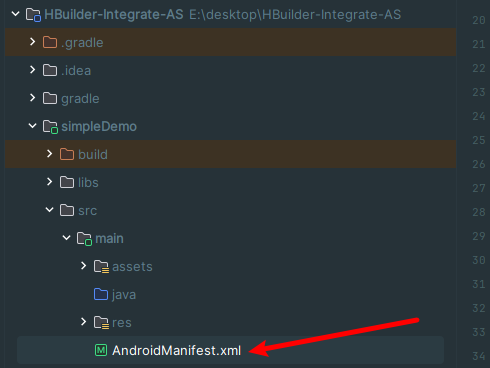

## 项目导入无模块

### 原因

#### 两个构建器插件版本不匹配

没有在下方构建报错进行下载构建器

在项目导入时使用的是open打开项目，不是导入项目

# 混合开发全过程总结（最后出现  appkey错误提示版本）

> 本次项目使用各版本如下
> 
> Android studio 运行时版本 17.0.9
> 
> Hbuilder X 4.15
> 
> Android SDK 4.15 使用项目(HBuilder-Integrate-AS)
> 
> Android Gradle Plugin Version 4.1.1
> 
> Gradle Version 7.2

## 过程

### 1准备好获取appkey需要的SHA1,SHA256,不必填的MD5应用签名

- 通过三方程序或网站进行获取，例如[android证书管理 (yunedit.com)](https://www.yunedit.com/update/androidzhengshu/list)
- 通过j在ava jdk打开终端使用命令构建。[Android平台签名证书(.keystore)生成指南 - DCloud问答](https://ask.dcloud.net.cn/article/35777)

### 在hbuilder x里面进行项目的离线打包，拿到离线包（例：__UNI__C3D00EB）

### 将离线包与HBuilder-Integrate-AS内apps下的演示包进行替换

### 将项目导入Android studio,或者新建Java语言的空项目，然后新建模块（未尝试通过）

> 导入 

### 更改文件

> 一  
> 
> ## ！这里的appid填写uniapp项目内的appid不要填写uniapp后台的包名/appid/域名，他只能用在包名
> 
> 

> 二  
> 
> 
> 
> 
> 三  
> 四，在这个目录下加入证书文件
> 

## 小心进坑

文件修改完成要进行重新构建（求保险可以在构建之前在清理缓存）

# 超级大坑！！！！

这里面的别名和密码（keyPassword和storeFile file是填写同一个密码）都是填写你在本地生成的那些，在uniapp的后台你只会用到包名和appid还有离线打包的appkey，不要使用这里面的云端证书内容去填写这个配置信息，不然一辈子都是”appkey未配置或错误“报错！！！！！！！！！！！！！！！！！！！

## 反复出现的问题

> ### 解决思路
> 
> 本次示例出现该问题的原因是插件模块的minsdk比app主模块的版本大，发生模块冲突，进行更改就好了，如果出现类似问题直接找到没有问题的模块的依赖配置复制粘贴解决最快

## API

[解决Android编译报错:Unable to make field private final java.lang.String java.io.File.path accessible-CSDN博客](https://blog.csdn.net/adojayfan/article/details/135765771)

[Uni-app 安卓篇离线打包 | 超详细 最方便\_安卓离线打包怎么配置通知消息图标-CSDN博客](https://blog.csdn.net/hkw20/article/details/121063641)

[【问题方案解决】[CXX1101] NDK at 目录\\Android\\Sdk\\ndk\\22.1.7171670 did not have a source.properties file-CSDN博客](https://blog.csdn.net/Aer_7z/article/details/132182732)

[记录【未配置appkey或配置错误】安卓开发uniapp的原生插件的步骤及避坑\_hbuilderx uniplugin-hello-as 运行时 报错 未配置appkey-CSDN博客](https://blog.csdn.net/weixin_43449246/article/details/120486710)

官方

[申请 | uni小程序SDK (dcloud.net.cn)](https://nativesupport.dcloud.net.cn/AppDocs/usesdk/appkey.html)

[未配置appkey或配置错误！怎么解决 - DCloud问答](https://ask.dcloud.net.cn/question/122067)

[开发环境 | uni小程序SDK (dcloud.net.cn)](https://nativesupport.dcloud.net.cn/AppDocs/usesdk/android.html)
