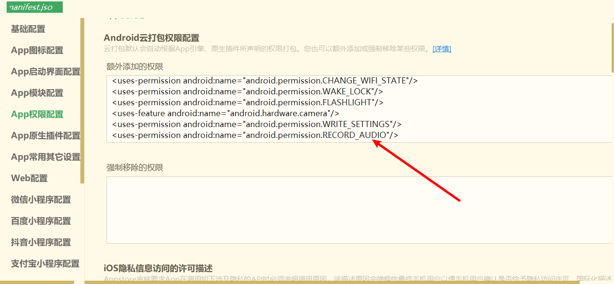

## 问题描述：app无法获取android麦克风权限，手机权限设置也没有显示该权限

### 解决办法

#### 在manifest.json文件配置app权限配置栏，增加安卓录音权限声明

## 重要的事情说三遍

然后进行重新打包！！！！！

然后进行重新打包！！！！！

然后进行重新打包！！！！！

## 权限优化方案

### 使用权限判断插件进行优化引导用户权限的设置

> [App权限判断和提示 - DCloud 插件市场](https://ext.dcloud.net.cn/plugin?id=594)

