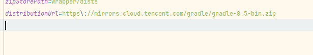

maven {url 'https://maven.aliyun.com/repository/google'}
maven {url 'https://maven.aliyun,com/repository/gradle-plugin'}
maven {url 'https://maven.aliyun.com/repository/public'}

gardle 包下载镜像gradle-wrapper文件修改

（1）官网地址：https://services.gradle.org/distributions/
（2）腾讯镜像 Gradle下载地址：https://mirrors.cloud.tencent.com/gradle/
（3）阿里云镜像 Gradle下载地址：https://mirrors.aliyun.com/macports/distfiles/gradle/
