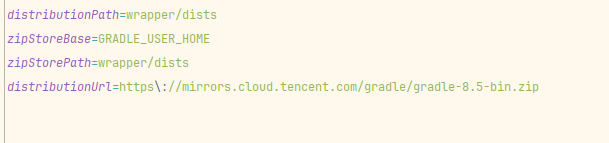
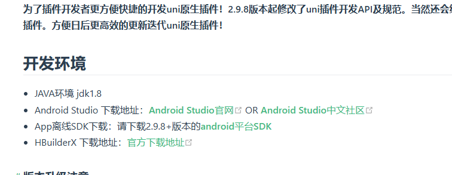

## 背景：hbuilder x 4.29 ＋ UniPlugin-Hello-AS 4.29插件开发项目 + jdk 17.0.13 + gradle 8.5 + gradle tool 8.2.2

## 修改构建环境

> ### 修改gardle版本
>
> 直接在项目结构里面修改或者在 gradle文件下找到gradle-wrapper.properties文件进行修改。前者缺点是默认官方下载，速度慢，后者缺点是你不知道版本的话容易写错
>
> 
>
> 

> ### 修改jdk版本
>
> jdk的版本修改可以在设置里面下载更新，也可以手动下载更新然后选择，还可以使用其他编辑器如idea下载然后Android studio进行选择
>
> 修改成功之后在项目结构中模块下的java还是1.8的Java8是没有关系的！！！不要手欠去改
>
> 
>
> 

> ### gardle 插件工具的版本更换
>
> gardle 插件工具的版本的只能在根目录下的build.gradle文件进行修改的，所以请仔细查询版本，在Android studio构建完成之后在工具也只可以进行升级，
>
> 还是文件比较好使。
>
> 
>
> 

## API:

[005课安卓原生插件开发-module扩展\_哔哩哔哩\_bilibili](https://www.bilibili.com/video/BV1um4y137ik/?spm_id_from=333.880.my_history.page.click&vd_source=dcc27590a4796352f516af56da8b7a0e)

[开发者须知 | uni小程序SDK](https://nativesupport.dcloud.net.cn/NativePlugin/course/android.html)

## 卡关大坑

> 过于相信下面这张图片，没有去查看版本更新日志文件，导致构建工具版本一直不对。




## 其他的需要改动的文件内容在之前混合开发和上述api都有介绍

需要增加的调试信息：加在下面文件根标签内

````xml
debug="true" syncDebug="true"
````


## 下面构建的引擎需要和hbuilder里面选择的保持一致


