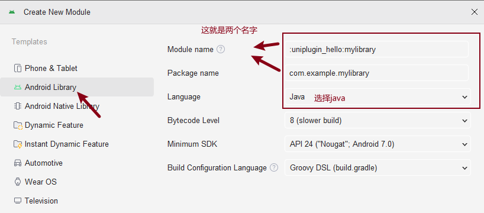

# 背景：

在完成UniPlugin-Hello-AS插件开发项目的导入和运行的情况下进行插件模块的创建和开发以及最后的插件压缩包构建，环境如下hbuilder x 4.29 ＋ UniPlugin-Hello-AS 4.29插件开发项目 + jdk 17.0.13 + gradle 8.5 + gradle tool 8.2.2

# API

[Android Studio Gradle没有assembleRelease等选项的解决方法\_androidstudio gradle assemblerelease-CSDN博客](https://blog.csdn.net/qq_21216109/article/details/135732186)

[开发者须知 | uni小程序SDK](https://nativesupport.dcloud.net.cn/NativePlugin/course/android.html)

[uni小程序SDK](https://nativesupport.dcloud.net.cn/NativePlugin/course/package.html)

## 创建插件项目

在根目录鼠标右击点开 新建 -> Module



新建一个类，这个类就是你接下来的逻辑代码的地方


## 编写代码（目前发现通讯成功类型只有string）

更新模块依赖

```gradle
compileOnly fileTree(dir: 'libs', include: ['*.jar'])

compileOnly fileTree(dir: '../app/libs', include: ['uniapp-v8-release.aar'])

compileOnly 'androidx.recyclerview:recyclerview:1.0.0'
compileOnly 'androidx.legacy:legacy-support-v4:1.0.0'
compileOnly 'androidx.appcompat:appcompat:1.0.0'
implementation 'com.alibaba:fastjson:1.2.83'
implementation 'com.facebook.fresco:fresco:1.13.0'
```


更新app模块依赖，目的是为了运行可以显示改插件模块


在创建的代码中进行编辑，示例如下，构建的类需要满足被UniJSCallback包装,示例如下

```java
package com.example.uniplugin_sum;

import android.util.Log;

import org.json.JSONObject;

import io.dcloud.feature.uniapp.annotation.UniJSMethod;
import io.dcloud.feature.uniapp.bridge.UniJSCallback;
import io.dcloud.feature.uniapp.common.UniModule;

public class SumModule extends UniModule {
    @UniJSMethod(uiThread = false)
    public void add(String OPTION, UniJSCallback callback) {
        Log.e("SumModule", "add--");
        Log.e("SumModule", "add--" + OPTION);
        try {
            JSONObject jsonObject = new JSONObject(OPTION);
            int a = jsonObject.optInt("a");
            int b = jsonObject.optInt("b");
            int c = a + b;
            callback.invokeAndKeepAlive(String.valueOf(c));
        } catch (Exception e) {
        }
    }
}
```

## 构建打包插件模块 arr/jar


如果不出现上述的选项；进行下面设置的更改

完成之后，选择项目展示文件找到包


## 创建插件包

文件结构如下：
文件名字和package.json和插件名字成功的是全部一致！！！

```text
DCloud-RichAlert/	   #插件id命名的文件夹
├── android/
│   ├── libs/
│   │   ├── xxx.jar         # 依赖的 jar 包
│   │   └── libxxx.so       # 依赖的 so 文件
│   ├── vendor.aar          # 依赖的 aar 包
│   └── unipluginRichAlert.aar  # 插件 module 的 aar 包
├── ios/
│   ├── Classes/            # iOS Swift/Objective-C 源代码
│   ├── Resources/         # iOS 资源文件
│   └── Podfile            # CocoaPods 配置文件
├── package.json           # 插件的配置文件
└── README.md              # 插件说明文档
```

package.json文件编辑成功样例

```JSON
{
    "name": "HelloAndroid",
    "id": "HelloAndroid",
    "version": "1.0.0",
    "description": "第一个安卓插件",
    "_dp_type":"nativeplugin",
    "_dp_nativeplugin":{
        "android": {
            "plugins": [
                {
                    "type": "module",
                    "name": "HelloAndroid",
					"class":"com.example.uniplugin_hello.HelloAndroid"
                }
            ],
			"integrateType": "aar",
            "minSdkVersion": "16"
        }
    }
}
```

压缩不压缩自己使用是无所谓的

## 使用

> 1. 在uniapp根目录下创建目录nativeplugins
> 2. 然后将没有被压缩的文件放入nativeplugins下
> 3. manifest.json选择本地插件选择对应插件
> 4. 进行云打包选择打自定义调试基座，然后传统打包
> 5. 最后选择自定义基座运行
