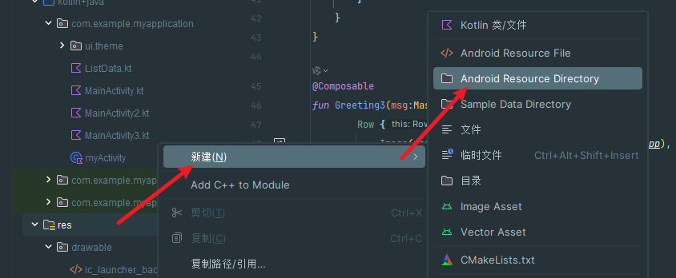
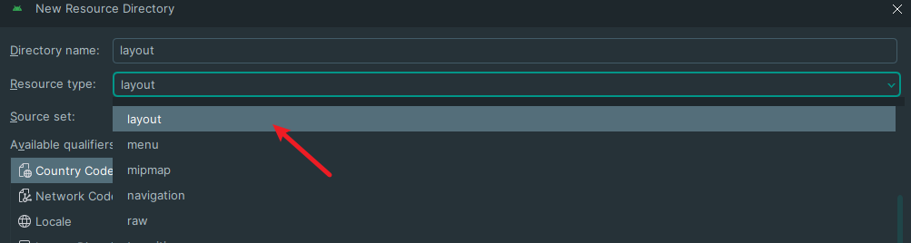
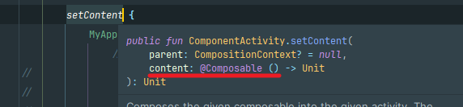
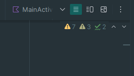
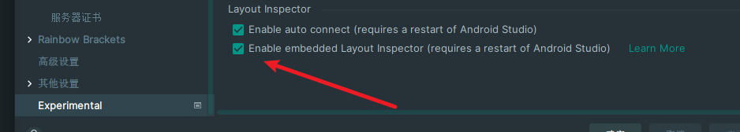
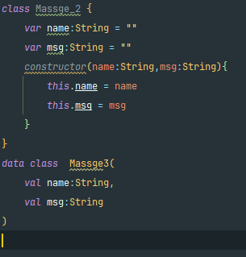

# 问题解答

> 项目创建之后没有layout目录，也不是一个Activity对应一个layout目录里面的xml文件的形式

现在的Android项目已经开始全面使用kotiln语言，但是这个语言和Java的关系就和ts和js的关系很像，他们也是可以兼容使用的，其次，现在的项目已经不是像以前的H5项目一样，是结构文件和逻辑文件分开，然后进行对应联系使用的方式，而是像vue，鸿蒙，一样逻辑，样式，结构都在一个Activity文件里面。(jetpack compose)

### 如果要使用之前的 方式的话应该在res目录下面使用

# jetpack compose，kotiln入门

### @Composable注解

创建一个容器函数必需要使用@Composable注解（感觉就像装饰器改个名）

系统的容器（可以理解为html的那些自带标签）只能在接受@Composable注解的函数内使用。（使用了@Composable注解的函数都接受这个，setContent也接受。不清楚函数是否接受，把鼠标移动上去就好了）

### @Preview注解

> 该注解是放在@Composable注解上面的可以将一个容器进行热更新，在右侧实时预览（必须具备默认值，不能接受参数，与外界有关联）点击右侧小手机进行运行
>
> 在这里选择视窗模式选择查看
>
> 出现渲染失败的情况：勾上下面这个选项

### kotiln

> 1 是强类型语言，必须规定类型
>
> 2 具备一些内置类，和比较多的语法糖。如果发现书写方式不符合自己的理解。可以往语法糖上面想

这两个类是一样的
