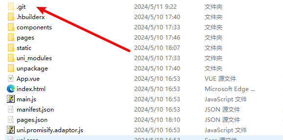

## GIT 新建仓库导入项目

### 准备工作

#### 创建好一个仓库

#### 准备好你要上传的项目

### 进入项目文件夹下终端（如下）

### 也可以使用git bash here打开

# 开始输入git 命令！！！

## git init (创建一个本地git目录)多次运行可能在git commit 会出错

## git add .(将该文件夹下面所有文件加入本地暂存)

## git commit -m "new"(创建一个自定义提交标题)

## git remote add origin ***git@gitcode.net:m0_70350693/usershoping.get***(后面地址是会更改的，去你的仓库获取，下图是gitcode)

这个问题报告是说你的远程分支已存在，直接git push -u origin maeter上传就好了

## git push *origin* maeter(origin是你的分支名字，一般第一次都是叫这个，也是你前面创建的那个名字，按照gitcode来就是默认这个)

# 注意事项！！！

# vscode 终端执行git 会出现git目录创建了不可见问题，增加本地目录不会有一长串代码执行问题，但是文件夹会显示git终端不会出现这个问题！！！

