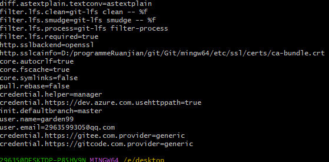
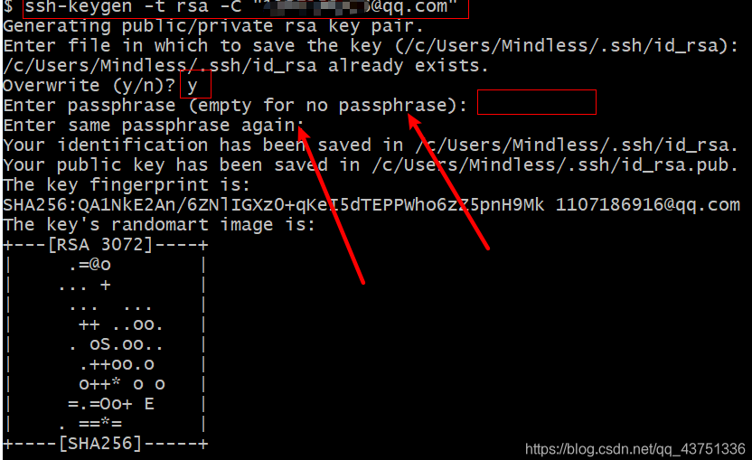
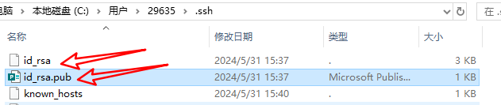
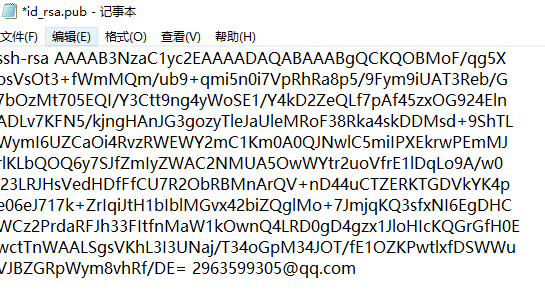
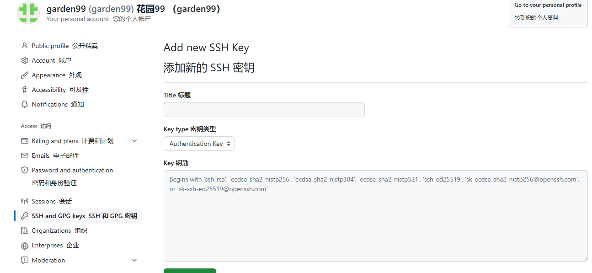

# 本篇文档演示github ssh方式

## 检查本地git 的全局配置对象中的name和email

如果发现不对，进行了更改，必须要重新生成ssh文件，因为这个文件是和user进行绑定的 ！！！

## 配置本地ssh步骤

### ssh-keygen -t rsa -C "设置的邮箱"

然后按照提示走就行了，第一次需要输入两遍密码，后面不需要，差不多一直回车

看见这个表情就说明你成功了，你的ssh文件夹会多两个文件

这两个文件是一定会有的，

### 然后用记事本打开id_rsa.pub，文件正常是这样的。

### 全选复制到你要上传的git云服务。GitHub的长这样，title随便取

## 进行到这一步就没有难点了。按照官方文档操作和GIT 新建仓库导入项目.md文档进行操作都没有问题
