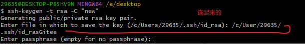
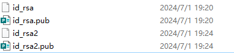
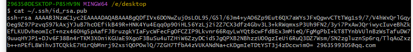
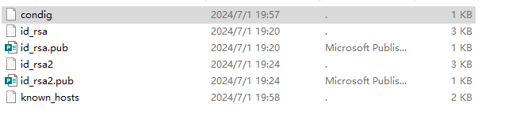
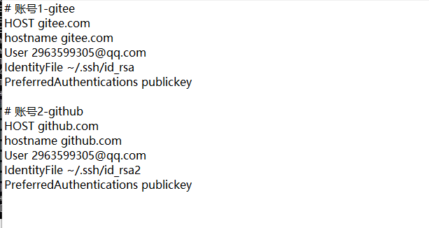

# API

[git ssh多账户登录使用 - 掘金 (juejin.cn)](https://juejin.cn/post/6844904025133940749)

[git多账号配置，同时使用多个代码托管平台 - 掘金 (juejin.cn)](https://juejin.cn/post/6942316089447546894)

# 背景

> 工作需要满足window同时两个git账号的连接，

> 使用工具：github,gitee,ssh命令，git

# 流程

> 首先确认电脑有没有之前的.ssh密钥文件,
> 
> git有没有进行全局的账号配置
> 
> 有的话都可以进行删除重置
> 
> ssh直接删除文件夹
> 
> git使用
> 
> git config --global --unset user.name
> 
> git config --global --unset user.email

> ## 生成配置公钥
> 
> ssh-keygen  主要用于生成、管理和转换认证密钥。常用参数：
> -t type:  指定要生成的密钥类型，有rsa1(SSH1),dsa(SSH2),ecdsa(SSH2),rsa(SSH2)等类型，较为常用的是rsa类型
> -C comment：提供一个新的注释，生成rsa秘钥，邮箱换成登录git的邮箱（非必要，这个就是自定义的注释和git commit -m一样）
> 
> ssh-keygen -t rsa -C "yourself@email.com"
> 
> 优化建议可以在上面命令执行之后在这里更改密钥的名字（在后面加上git平台的名字）
> 
> 
> 
> 
> 
> 然后打两下空格（即不输入密码），进行密码和确认密码。
> 
> ## 重新配置公钥到不同git平台
> 
> 生成两密钥个文件之后可以使用以下命令进行查看
> 
> 
> 
> ls -l ~/.ssh 输出.ssh文件夹下面所有文件
> 
> cat ~/.ssh/id_rsa.pub 输出该文件的密钥
> 
> 
> 
> 然后分别复制这两个密钥到各自对应的平台

> ## 创建配置config文件
> 
> 好像这个文件名字不重要，我输入成了condig一样没出问题（注意该文件是没有后缀名的文件，查看编写使用记事本以文本操作）
> 
> 
> 
> 该文件的配置
> 
> 
> 
> HOST :别名，按理说是顺便设置，但实际上不是。需要设置成你对应git平台的主机地址如（github.com,gitee.com）
> 
> hostname : 主机名，也接受数字ip地址（github.com、gitee.com、198.168.1.227）
> 
> User ：用户邮箱，你在git平台上面的绑定的邮箱（2963599305@qq.com）
> 
> IdentityFile : 密钥文件的地址，注意是私钥（就是文件没有图标，没有pub后缀名的如id_rsa、id_rsa2）
> 
> PreferredAuthentications publickey 不知道是什么作用

> # 最后一步，为每一个项目单独配置用户名和邮箱
> 
> ### 配置git全局用户
> 
> git config --global user.name "yourname"
> 
> git config --global user.email "jianqi.gao@jimubox.com"
> 
> ### 清除配置git全局用户
> 
> git config --global --unset user.name
> 
> git config --global --unset user.email
> 
> ### 在当前项目配置 user
> 
> git config user.name "yourname"
> 
> git config user.email "youemail"
> 
> ### 查看git当前配置
> 
> git config --global --list
> git config --list
> 
> ！！回车才能看到后面的配置信息，如邮箱和用户
