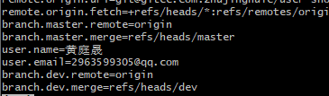

# 背景

将拉下来的项目进行更改分支然后上传

## 流程

1 切换到目标分支

> git checkout feature-branchmain  # 或者 git switch main 如果你使用的是较新版本的Git

2 将你的工作合并到目标分支

> git merge feature-branch

或者，如果你想要保持一个线性的提交历史，你可以使用变基（rebase）来代替合并：(当时使用的不是这个)

> git rebase feature-branch

但请注意，`rebase` 实际上是将`feature-branch`上的更改重新应用到`main`分支的当前状态上，从而创建了一个新的提交历史。这在你还没有将`feature-branch`推送到远程仓库时特别有用。

4 查看git配置是否正确

> git config --list
>
> 
>
> 出现有关你分支的字母就大概率成功（可以询问ai配置信息）

5 推送到远程对应分支

> git push origin feature-branchmain origin是本地创建的分支，feature-branchmain是你要切换仓库的分支
