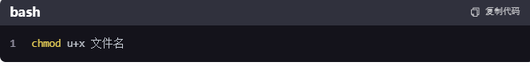

## linux 常用命令

## 展示文件下文件

> ls -l 路径
> 
> ls列出该路径下文件
> 
> -l 展示详细信息

## 建立文件联系

> ln 建立文件联系（参考Windows的path）
> 
> sudo ln -s \$(pwd)/nodejs/bin/pm2 /usr/local/bin/pm2
> 
> \$(pwd)当前目录

## 移除一个文件

> sudo rm /usr/local/bin/pm2
> 
> 移除一个文件

## 将任务放入后台

> nohup npm run start &
> 
> 可以不中断当前执行，继续新的执行
> 
> &将任务放入后台
> 
> 这将启动你的服务，并将输出重定向到当前目录下的 `nohup.out` 文件中。你可以通过查看该文件来跟踪服务的输出。

## 设置文件权限

> chmod [选项] 权限模式 文件名
> 
> 用户选项：u `（用户）、`g `（组）、`o `（其他）和`a `（所有）来指定权限更改的目标，以及`+`（添加权限）、`-`（移除权限）和`=`（设置权限）来指定操作。
> 
> 1. **读（r）**：允许查看文件内容或列出目录内容。
> 2. **写（w）**：允许修改文件内容或在目录中创建、删除文件。
> 3. **执行（x）**：允许执行文件作为程序。
>    

