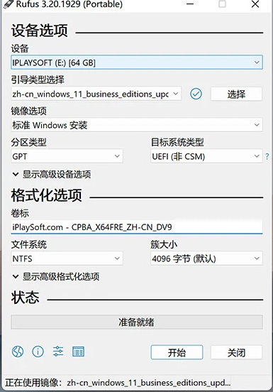

# 关键步骤：

## 正确的系统启动upan制作：选择正确的分区类型，文件系统。

1.如果您的计算机使用 BIOS 引导方式（传统 BIOS），则选择 MBR 分区类型。
2.如果您的计算机使用 UEFI 引导方式，则可以选择 GPT 分区类型。

注释：引导方式在电脑开头启动查看，网上有教程

文件系统：两个类型都可以，但是推荐使用默认的NTFS类型.

使用检查坏块会使这个烧录过程非常缓慢！

## 安装过程：

将烧录好的U盘插入电脑，然后电脑重启进入BIOS/UEFI启动界面。选择从U盘启动

然后选择你的安装系统——会出现U盘烧录的系统选项（可能不止一项，发现不对可以更换在尝试），比如ubuntu的启动U盘会携带低图像界面的版本，体验测试版本等等。大概率是第一个选项。

注意事项：进入之后如果不是安装选项的话注意看电脑等待界面提示，20.04的安装进入在这里，22.04的安装在进入体验里面的主面板里面。24.04的直接进入就是安装选项。

注意事项：如果进入的很快，并且无法弹出启动U盘，且没有安装系统选项——那么这就是体验选项

然后就是一路回车。。
