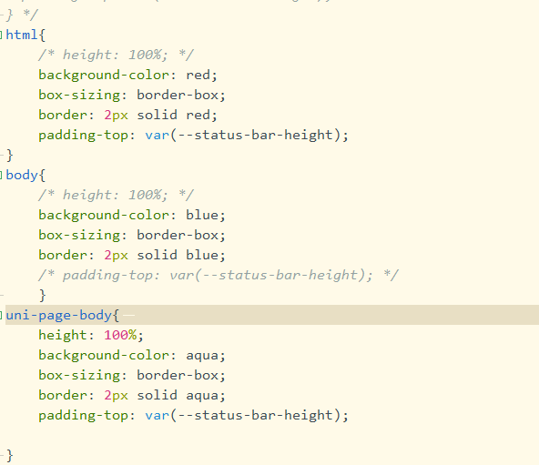
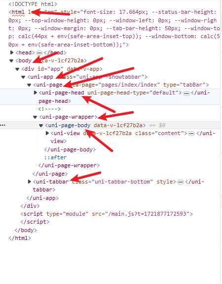

> 在这个标签里面书写的这些标签都是可以在浏览器页面元素里面找到的，等于是全局的编辑页面样式，然后会被下级继承

> 他们的层级关系可以在这个图看出来，他们的样式显示符合css规则，然后html和body标签的宽高需要注意默认是100%，而不是fit-content

> 然后uniapp的默认导航栏是uni-page-head标签，底部主页导航是uni-tabar标签——这个表情之所以结构在uni-page-head标签的父标签uni-page标签里面，但是确没有被包含在最大的html和body里面是因为它使用了**position**: **fixed**;绝对定位固定在了下方

> 然后--status-bar-height变量在浏览器是0

## app端打包之后的特殊

> -status-bar-height变量在app是跟随手机状态栏高度变化的

> 手机端的原生导航栏显示层级很高，不确定是不是使用固定定位上去的HTML上方。导致HTML标签的高度只有去除上面和下面的导航栏高度

## 微信小程序端打包之后的特殊

> -status-bar-height变量微信小程序是固定的25px

> 微信小程序是又检查模块的，可以直接像浏览器一样去读它的元素结构和样式来理解

