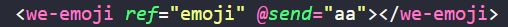
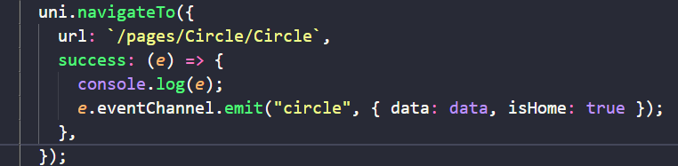
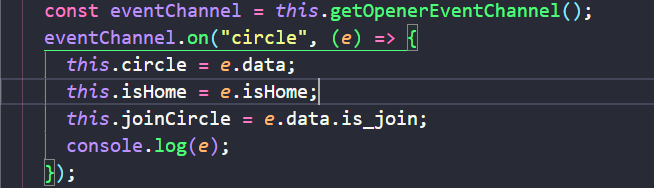
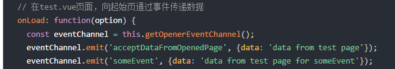
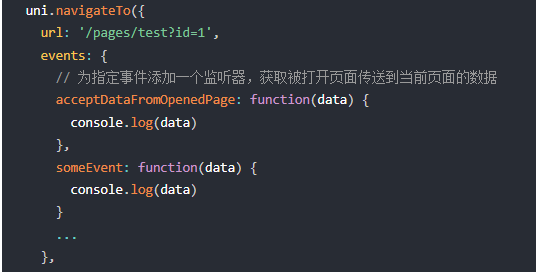
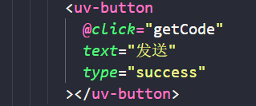
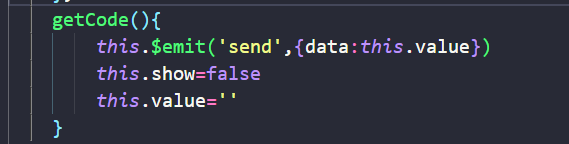
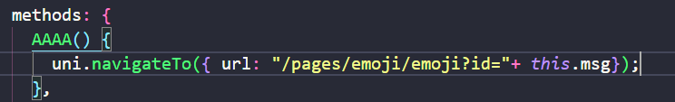
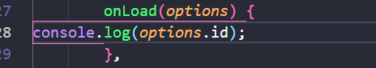
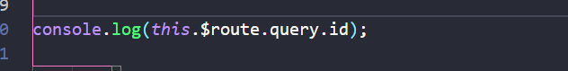

## emit on 与 \$emit  \$on 的区别

emit和on不带$的是页面组件级的实例使用
\$emit和\$on带$的是功能组件级的实例使用

### 页面组件和功能页面的区别

#### 相同：他们两本质都是组件，都是由html,js,css组成的展示模块

#### 不同：页面组件是包含与功能组件的，页面组件的范围更大，功能组件一般还需要经历导入，注册才可以使用使用方法也是如下

#### 归纳：他们俩本质都是一样的，只是页面组件出生在罗马，功能组件出生在农村，功能组件需要引入注册才可以展示出来

## 页面组件内的事件发射器使用方法

使用的时候需要将在类型EventChannel上面使用emit。已知navigateTo跳转方法具备该类型（猜测原因是两个页面之间通信，需要满足两个页面都在页面栈中）

### 跳转页向被跳转页发送

通过成功回调函数success的回调参数EventChannel进行自定义事件绑定

被跳转页接受方式
注册getOpenerEventChannel事件，通过给该事件使用on注册自定义事件回调

### 被跳转页向跳转页发送

注册getOpenerEventChannel事件，通过给该事件使用emit注册自定义事件，传递数据，事件给跳转页

跳转页接受
在navigateTo的events属性里面添加与之前使用emit注册的自定义事件名字一样的函数，函数会在事件传输过来时触发并且接受参数

## 功能组件内的事件发射器使用方法
在需要绑定自定义事件的触发事件（如click）绑定的函数使用\$emit进行事件绑定总结（让组件的事件触发可以反应到页面上）
事件接受
在功能组件上直接绑定自定义事件

## 补充

页面使用路由传参
传递
将参数拼接到路由

接受方式
1

2

## API

[uni.navigateTo(OBJECT) | uni-app官网 (dcloud.net.cn)](https://uniapp.dcloud.net.cn/api/router.html#navigateto)
[一次说清Vue的\$emit()事件\_emit事件-CSDN博客](https://blog.csdn.net/thankseveryday/article/details/95972581)
[VUE----页面组件与功能组件带你认清页面组件与功能组件的区别\_什么是功能性组件-CSDN博客](https://blog.csdn.net/bigdatahyy/article/details/121016616)

