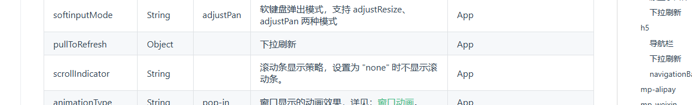
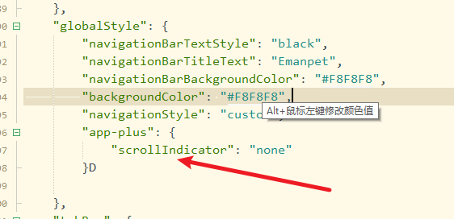
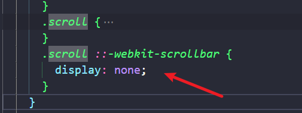
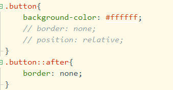

# 关于uniapp的坑

# API

> ```
> this.$forceUpdate()
> ```
> 
> 强制刷新

# 事件篇

## 文档参考

[uniapp 点击，长按，触摸，结束触摸事件 - 风花一世月 - 博客园 (cnblogs.com)](https://www.cnblogs.com/fhysy/p/14760040.html)

### 长按事件

长按事件使用@longtap,防止事件污染可以添加变量标签长按是否触发来决定触摸结束的执行

## 组件篇

### 文档参考

## scroll-vie组件

scroll-vie组件内不滚动的重要说明，如果是scroll-vie组件内包含一个特别大的容器，那么只需子容器比scroll-vie组件大，且scroll-vie组件设置宽度即可：：：如果scroll-vie组件包含多个子容器，使用flex布局试图水平是无效的，可以使用

```
white-space：nowrap
```

属性需要满足scroll-vie组件子组件具备是行内属性如行内块，行内弹性

```
display: inline-block;
display: inline-flex;
```

滚动条在手机端默认展示问题可以通过全局手机端设置scrollIndicator属性为none





> 滚动条在H5默认显示，滑动后不显示，可以使用伪元素-webkit-scrollbar控制不显示

-webkit-scrollbar

## button

去除默认样式

> 只需要更改背景颜色和after伪类的边框就好了
> 
> 

注意要点！！

> 当使用position static定位时，点击事件绑定会受到影响！！！！

## 生命周期篇

注意在没有销毁页面的时候onLoad不会触发回调，

想要跳转tabBar页面，并且触发页面回调，使用 uni.relaunch()

首页的olLoad不会被navigateTo触发
