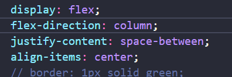

# 2024/08/02

## 一，进行页面rpx单位的更新

```
"rpxCalcMaxDeviceWidth": 2560, // rpx 计算所支持的最大设备宽度，单位 px，默认值为 960
"rpxCalcBaseDeviceWidth": 1280, // rpx 计算使用的基准设备宽度，设备实际宽度超出 rpx 计算所支持的最大设备宽度时将按基准宽度计算，单位 px，默认值为 375
"rpxCalcIncludeWidth": 2560, // rpx 计算特殊处理的值，始终按实际的设备宽度计算，单位 rpx，默认值为 750
```

## 二、manifest.json文件修改app-plus的下级加入

```
"orientation" : [
		//竖屏正方向
		"portrait-primary",
		//竖屏反方向
		"portrait-secondary",
		//横屏正方向
		"landscape-primary",
		//横屏反方向
		"landscape-secondary",
		//自然方向
		"default"
	]
```

## 三，在需要使用横屏切换的页面进行调用（函数内使用上面文件列表增加的字段）

```
// 页面加载完给自然方向，它就能根据用户横竖自动切换
	onLoad() {
			// #ifdef APP-PLUS
			plus.screen.lockOrientation('default');
			// #endif
		},
	// 页面关闭时清除横屏正方向
	onUnload() {
			// #ifdef APP-PLUS
			plus.screen.lockOrientation('portrait-primary');
			// #endif
		},
```

## ！！！注意要点，使用rpx单位的屏幕切换会出现异常（即屏幕切换了，rpx单位还未即时更改，uv-ui组件库使用的是rpx单位），建议使用vh,vw rem

## 奇怪bug,在使用横屏切换的时候会长出屏幕一截(目前通过删除原因css代码实现)原因代码是下述css代码



## 其他

> uni.onWindowResize(CALLBACK)可以监听页面尺寸变化

## api

[uniapp 移动端 两种横竖屏切换方案\_uni.previewimage 竖排展示-CSDN博客](https://blog.csdn.net/Steven_Son/article/details/115562324)
[uni.onWindowResize(CALLBACK) | uni-app官网 (dcloud.net.cn)](https://uniapp.dcloud.net.cn/api/ui/window.html)
[uniapp 横屏开发页面配置（仅支持App、H5）\_uniapp 设计稿是横屏的基准宽度怎么设置-CSDN博客](https://blog.csdn.net/u012576295/article/details/119866395)
