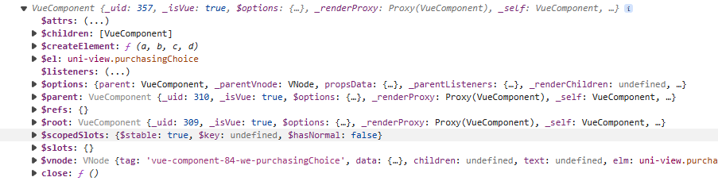
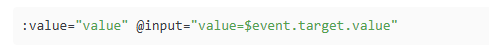
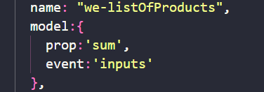
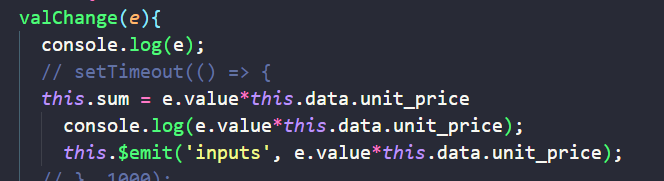
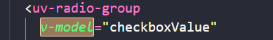

# 自定义组件的封装

## ref

ref为子组件赋予一个ID引用，在vue的js可通过this.\$refs.xxx来获取到组件对象。可以通过this.\$refs.xxx.属性/$refs.xxx.方法触发和更新子组件里面的数据

注：组件对象需要在渲染完成之后才具备，打印出来如下

## v-model

v-model是一个语法糖，它做了两个事情，一，通过props进行数据父传子，二，子组件通过model派发更新父组件数据的事件，

> 默认的绑定数据为 value ,事件为 input

### 手写v-model

在子组件使用model进行数据和事件的派生绑定，这里的数据必须是props里面具备的（因为父组件更新子组件是通过prop进行）然后事件的触发需要自己编写

本质就是v-model就是**绑定了一个名为value的props给子组件传值和一个事件input**接受子组件的变化值

> 事件和数据名字随意

> 父组件就简单多了，就v-model绑定一个值就好了

## api

[vue.js - 手动实现一个v-model的不同做法(含封装组件用法) - 个人文章 - SegmentFault 思否](https://segmentfault.com/a/1190000021951046)
