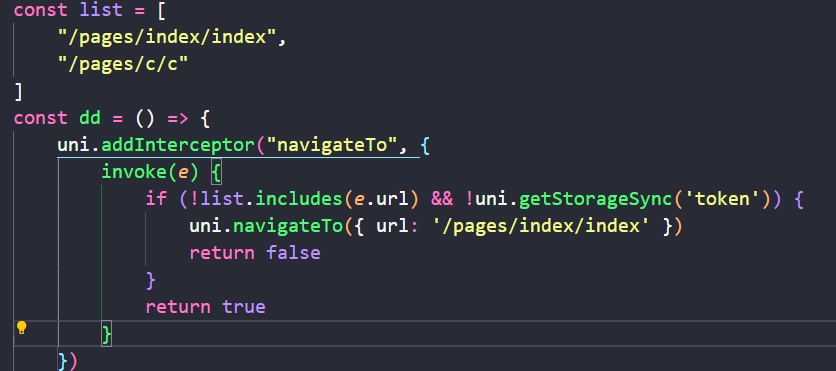
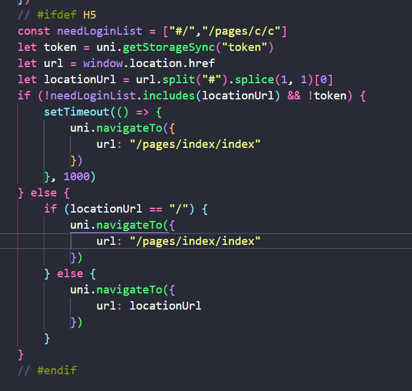

# 使用方案

## 在生命周期钩子函数里面进行条件判断，来决定用户有无权限进行进入该页面，

注意：该方式需要注意注册了tabbar的页面会被缓存，有些钩子函数如（onLoad）无法触发

缺点：每个页面都需要书写，无法统一配置页面白名单，无法拦截导航栏直接输入网址跳转

优点：简单，不用新建文件，哪里写了，就哪里用

## api

# 使用uniapp的addInterceptor Api，该api是拦截其他api的拦截器，可以使用它拦截页面跳转的api，进行权限判断，然后重定向

注意：重定向的时候如果使用被监听拦截的api,也会被拦截处理，需要递归终止处理。使用路由白名单进行处理判断，（注：首页的路由显示为http://localhost:8080/#/类型）

缺点：较为复杂，需要创建文件，并且在main.js里面导入使用，无法拦截导航栏直接输入网址跳转

优点：一次书写，多页面使用

## api

[uniapp通过uni.addInterceptor实现路由拦截功能\_uniapp路由拦截-CSDN博客](https://blog.csdn.net/qq_37906822/article/details/122704299)

[uniapp如何实现路由守卫、路由拦截，权限引导\_uniapp 路由守卫-CSDN博客](https://blog.csdn.net/m0_57033755/article/details/132871892)

# 补充h5的导航栏拦截方法，使用window.location API，拦截不在白名单的url地址

注意：注意#，注意使用h5条件编译，重定向的时候需要等待一些时间，不然会无法重定向，通过实验发现，导航栏地址跳转比uniapp的navigateTo优先级高

## api

[关于使用uniapp开发H5路由拦截的用法和建议\_uniapp 拦截路由 hash #-CSDN博客](https://blog.csdn.net/u014535666/article/details/129125779)

