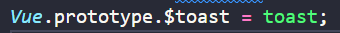
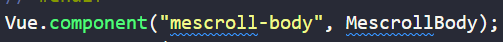
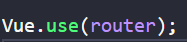

## prototype

> 通过prototype绑定在vue实例上面的属性，根据vue 实例树的结构，会被所有下级vue实例继承。在main上面绑定的是app根实例，所以所有页面都可以通过指向vue实例的this来引用该属性

## component

> 见名知意，该属性方法的作用是将一个组件进行全局绑定，使所有下级页面都可以直接使用

## use

> 对vue实例安装一个指定的插件，方法执行，将当前的vue实例传递给安装的插件的install方法。安装的插件必须具备install方法

## mixin

> 将方法接收的参数混入当前vue实例。

> 混入理解：将一些配置添加进vue实例，（将一段代码添加进实例里面）
