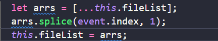

# 用法

## 1、普通监听（无法监听到第一次绑定的变化）

```
//监听   当userName值发生变化时触发
watch: {
    userName (newName, oldName) {
        console.log(newName)
    }
}
```

## 2、普通监听（可监听到第一次绑定的变化）

```
watch: {
    userName: {
        handler (newName, oldName) {
            console.log(newName)
        },
        immediate: true
    }
}
```

## 3、深度监听（可监听对象内属性变化）

```
data (){
    return {
        cityName: {name:'北京'}
    }
},
watch: {
    cityName: {
        handler(newName, oldName) {
            console.log(newName)
        },
        immediate: true,
        deep: true
    }
```

## ！！！监听对象时会产生的问题（内存地址问题）

当你使用对象的一些自带方法修改对象本身时（例如数组的splice（）方法），因为使用的一直是一块内存地址，而不是将一块内存地址的值赋给另一块内存地址的值，所以会导致监听函数触发，但是输出新旧值都是更新之后的值

> 解决办法参考
> 开辟一个新的内存地址对象来进行修改，结束的时候在进行赋值给源对象




