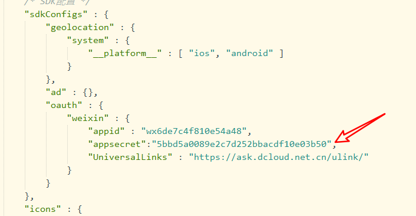

# 关于微信的那些事

## 小程序认证——认证扫码登录的如果不是管理员后面管理员认证也无效！！！！！！

## 小程序登录

### 文档参考

[超详细的uniapp实现微信登录功能\_uniapp 微信登录-CSDN博客](https://blog.csdn.net/qq_42625428/article/details/116263032)

[uni.login(OBJECT) | uni-app官网 (dcloud.net.cn)
](https://uniapp.dcloud.net.cn/api/plugins/login.html)

### 微信小程序端，完成微信认证拿到appid填入配置文件即可

appd端，需要在微信开放平台完成app认证并且开通微信登录权限，拿到的appid和appSecret才有效，

并且疑似要在配置文件源代码视图下新增字段appSecret**!!!!**

