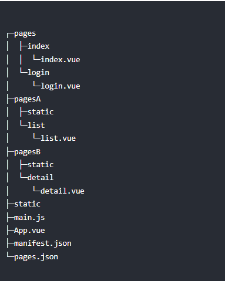

# 过程（建议项目一开始就建立好分包的结构）

> 在manifest.json里面的小程序下面增加optimization":{"subPackages":true}，开启分包

> 在pages.json里面进行对应项目结构的配置如果项目结构是下图
>
> 
>
> 则需要进行

```
{
	"pages": [{
		"path": "pages/index/index",
		"style": { ...}
	}, {
		"path": "pages/login/login",
		"style": { ...}
	}],
	"subPackages": [{
		"root": "pagesA",
		"pages": [{
			"path": "list/list",
			"style": { ...}
		}]
	}, {
		"root": "pagesB",
		"pages": [{
			"path": "detail/detail",
			"style": { ...}
		}]
	}],
	"preloadRule": {
		"pagesA/list/list": {
			"network": "all",
			"packages": ["__APP__"]//这个地方填写的字段需要注意一下，__APP__会报错！！
		},
		"pagesB/detail/detail": {
			"network": "all",
			"packages": ["pagesA"]
		}
	}
}
```

# 注意点

分包之后的路径会发生变化，资源的引用要根据文件结构理解（不要死记硬背）

@ :项目根目录

/ :uniapp自己定义的项目根目录，分包之后会改变

./ :当前目录

../ :当前目录的上一级目录

# API

[pages.json 页面路由 | uni-app官网 (dcloud.net.cn)](https://uniapp.dcloud.net.cn/collocation/pages.html#condition)
