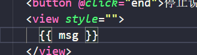
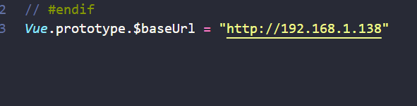
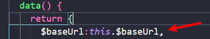

# 微信兼容问题

1.微信小程序并不支持空的未进行赋值的属性如下style=“”

****

2.会对为null的属性进行显示，如上图的msg若为null那么页面会显示null

3.页面的dom元素直接使用绑定字vue原型链下面的变量，参数，会变成undefined，可以在vue变量声明里面声明一个同名参数并且将变量赋值给它

## API

[小程序/uniapp支持的css选择器一览\_uniapp css after-CSDN博客](https://blog.csdn.net/wwf1225/article/details/90286916)
