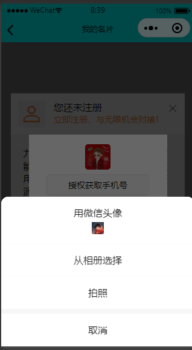

# 获取用户信息

**getUserProfile **等直接返回用户头像信息的接口被取消，替代解决方案是通过用户选择授权提供 这些信息

## uniapp微信小程序的解决方法

uniapp的button组件的open-type设置，然后通过事件回调获取值（此方法可以获得较多信息）

uniapp的input组件的type设置nickname，然后通过v-mode属性绑定获取值（此方法对微信小程序只能获得昵称）

uniapp获得的手机号是加密的，需要使用微信官方的解密工具进行解密，文档在下方

## 文档参考

[button | uni-app官网 (dcloud.net.cn)](https://uniapp.dcloud.net.cn/component/button.html#button)

[uniapp微信小程序获取用户头像和昵称填写能力调整解决方案\_uniapp type="nickname-CSDN博客](https://blog.csdn.net/m0_48048146/article/details/127692466)

[input | uni-app官网 (dcloud.net.cn)](https://uniapp.dcloud.net.cn/component/input.html#type)

[uniapp微信授权+获取手机号+解密手机号（带图详解）\_若依+uniapp微信如何授权获取手机号码头像登录-CSDN博客](https://blog.csdn.net/weixin_45721912/article/details/117627134)
