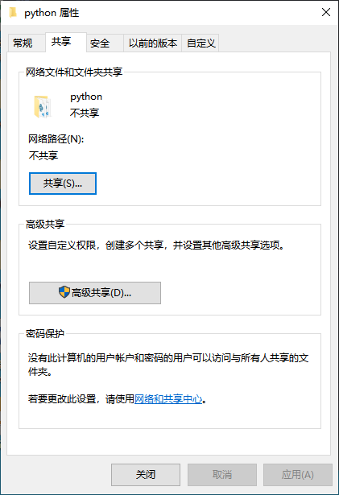
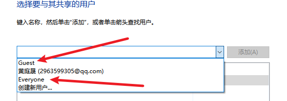
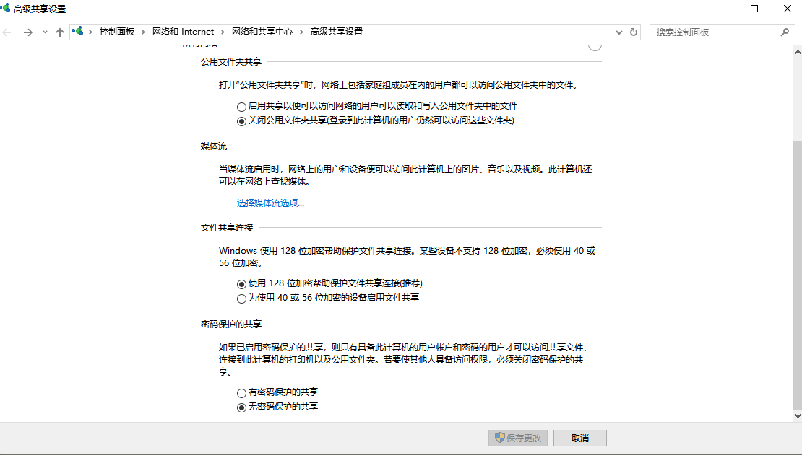
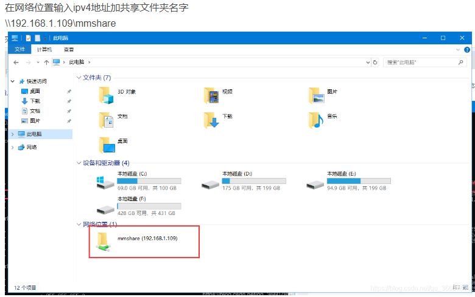
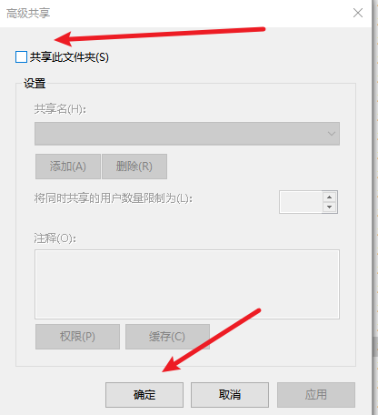
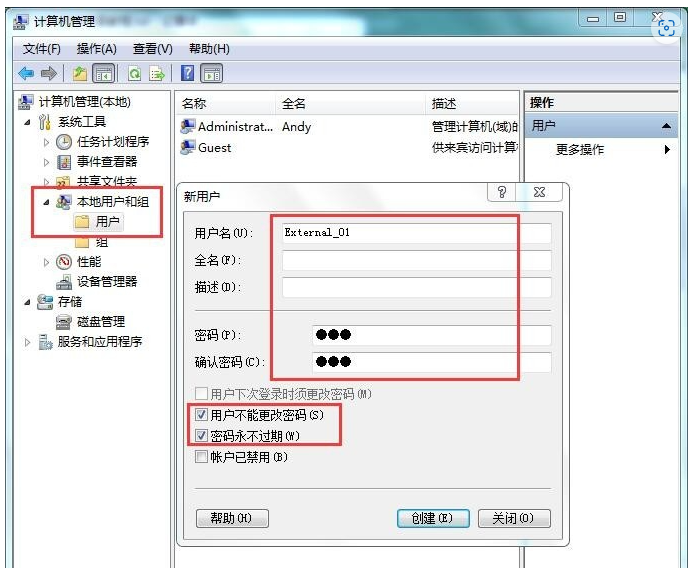
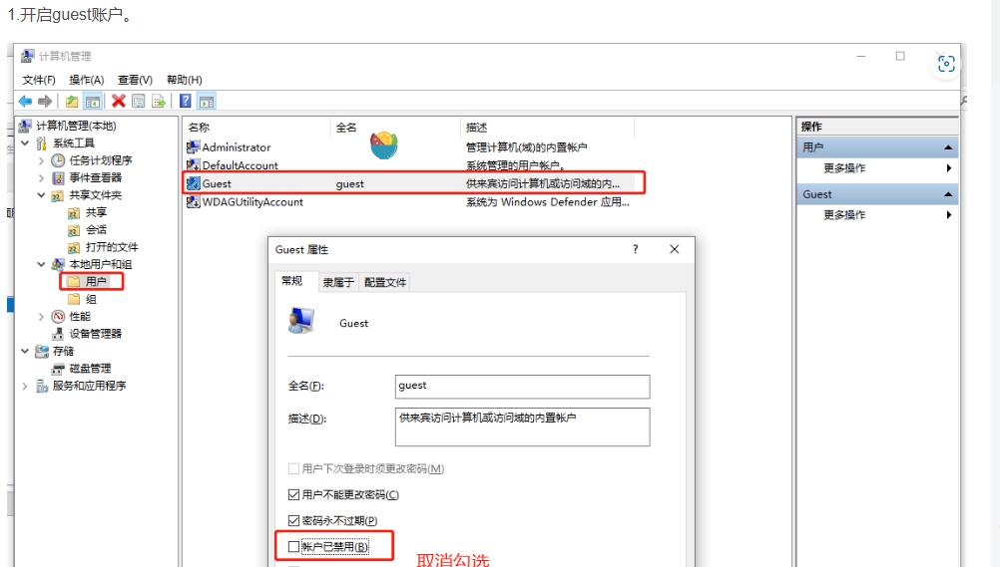
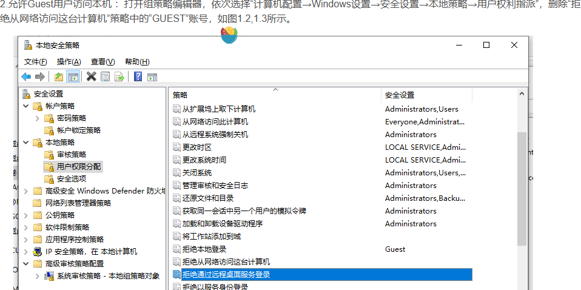

打开共享添加用户(Everyone是所有人)，有人访问过你的地址，就会有来宾选择（下图的Guest）

然后点击共享

高级共享可以设置共享名字，数量，权限和备注等

> ### **特别注意，创建的组，在高级共享里面进行权限配置无用，最后还是需要在共享里面添加用户！！！！**

！！ 网络和共享中心可以设置需不需要密码和开不开启共享，这里需要启用网络发现才能接收和发送，启用启动文件共享才可以共享

使用终端cmd输入 ipconfig得到ipv4地址

接收

> 终端接收

在终端直接输入\\\加需要接受的文件的ipv4地址——反斜杠！！

然后就是输入账号密码或者直接进入

> 文件夹接收

关闭共享

选择高级共享，然后取消勾选共享此文件夹->确认

## Api

[win 10局域网共享文件夹设置完整教程\_局域网共享 最全 设置-CSDN博客](https://blog.csdn.net/qq_36607894/article/details/100534393)

[Win10共享文件夹，创建（启用）用户并分享文件、修改特定用户访问权限\_文件夹固定分给指定域用户csdn-CSDN博客](https://blog.csdn.net/weixin_42253874/article/details/103815478)

[Windows如何共享，文件共享、权限配置、访问限制教程\_电脑访问权限怎么设置-CSDN博客](https://blog.csdn.net/loveyelong/article/details/122995641)

# 文件共享权限管理重要理解

## 用户需要在共享电脑上面添加

## guest 重要！！ 这个用户是所有来宾的，是来访电脑的最基础用户，它得满足最小可读权限，

同时取消禁用

关闭拒绝guest用户在远程登录设置

# 如果连接共享电脑时不弹输入账户密码窗口，可以通过右击共享文件夹，打开使用其他凭证登录，如果选择记住你的凭证，那么下回就不用点击了

# 电脑开机登录选项过多避免。

打开本地安全策略 -> 本地策略-> 用户权限分配，修改本地登录选项，不允许本地登录选项增加你创建的用户，或者删除允许本地登录里面的你创建的用户

