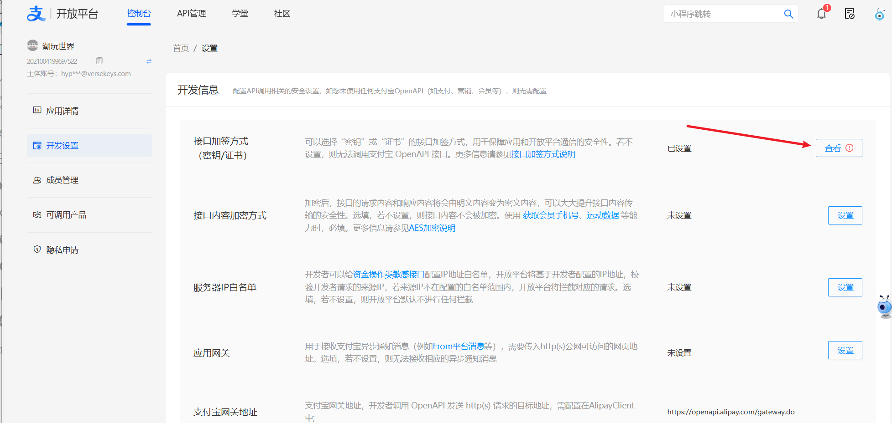
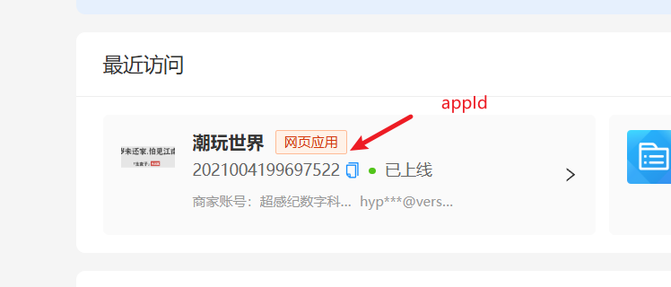

## 支付难点：使用三方（支付宝，微信）规定的加密方式进行加密

### 准备：

应用私钥

支付宝公钥

应用appid


> 在支付宝创建应用，需要在线的，然后点击接口加密方式进行创建应用公钥换取支付宝公钥，这里会提供给一个软件生成本地密钥对，保留私钥，将该公钥上传到支付宝换取支付宝公钥





然后原封不动抄支付宝提供的node的接口代码不会发生错误

## 特殊参数

### notify_url

> 回调地址，支付宝会携带支付结果参数访问这个地址

### return_url

> 支付宝网页上面支付完成之后等待若干秒之后跳转会的网址，会在网址上面携带参数返回到这个地址

```js
var express = require('express');
var router = express.Router();
const bodyParser = require('body-parser');
const { AlipaySdk } = require("alipay-sdk");
const crypto = require('crypto');
const cors = require('cors'); // 引入 cors 中间件
const { log } = require('console');
//生成随机数
function generateOutTradeNo() {
    const timestamp = new Date().getTime(); // 当前时间戳
    const randomNum = Math.floor(Math.random() * 1000000); // 随机数
    return `${timestamp}${randomNum}`.slice(0, 32); // 截取前32位
}

const info = {
    appId: "2021004199697522",
    privateKey: "MIIEvAIBADANBgkqhkiG9w0BAQEFAASCBKYwggSiAgEAAoIBAQCEtW1cv1fSVAHpjf0K4+73XSlPx31FhKkPT6/kT9xT30DjOFnxdg9abZK43rEIMRQUwHwjquj9GNOyFgeBD8V1lbWl1I9H4LPod96m+TZiL1PBxVsGFRiokeqO8J8MaTKg48oQihFtCws7wXrOZ82rLgw7kl0hIGFdY2egn/u9nBX4M9w9DmrKC/eKabY5ecI4NQQwwawZSKpxK1UzQbrZ8fvZgRaW7bxSKInL/szupYzfZYuxLfXRx+1iQcI0KycvQz/TL9q2ygD7v1tZ3j3HYhbVJgp/CUxUk7ry+aIZr4UZZ8fMr8rtL0HpOQDwYCXbn6Rrlf104xlYOl3KPKaXAgMBAAECggEACzO1U4rjQuHMd4aAwZaT6VV300AnluKn0p8LXd5P3tSNiaCMFxG8Ign1xJ0nnGVoKIhG8kvO9u5NkE7Du2U1acOFXcYfghW5mfnkVXvb11XfYA/kqxLEzhXjEsXE5ytKFsKjn9nHtsij3htq3llsxvJQHgcwzUcKcPOfH7PhcBPJsUV64UhPfae8A8oG7uxRGZm6YidOqXXZzxSZmkickXNyU1Le84Nnt95EPmKQkjG+YoNczBD7vCv5xJZ8syQAXTTPtgC99LFTIo8E7rIHwZ1RtqgV66uPM1m549lyXCWnODgkY4Dt4X0UwJQAAz5ITqtC8hihpvSStsd8echcQQKBgQDAlLxqCoyveoyAD89EhGo65clRYLx7D2sMmSNTAFA1FU6SDUVGX34frxe2UKRgInIXtPKWvmnlY0OxLdZ5auapsKC3KDOoCmrDdj8K38TN7Hr0Zq1WYy8IKFRC2Suv8oNhwV8qSHG+5zZqhvWAxEnOQOCGmKK7lCsEkOXpD8Xv3wKBgQCwaT493rEVLjcDcLLAhJkPeGviY9c/cPIDDZmnjJ3ohMbHVSfm38W4nxYwX9Pm7oX81fXbnYkGYfFbdh6XYWQqgwXkiOenORXC/MtOLSTMy03mFqYHDAzaKIDA9Y37hQUcOSaS+2OPJpk5Oj8H45rl5/SJfgG1CDqAuYfDtZzASQKBgD/KBI7rZ6ZIZXmVwwXjBnzz2DdIX6YzeTX3E6hOlkK/CAOAuc2Rm+lKygPtukTNpBUOLryX3ePJeYaatEwLiNP0WYfRnSqwKKUN6dvkOwAqsJ970zamK9H76c0qujnRjos2zhrnXCXr2C54/aDlY70Z6EUtEdooPgeJJ16HhvzpAoGACzbFdB1h2FzVtmxFkKNdL3SSNxPtrOS7HaKRr+rqZst571XkcXKsGO5T9MNCrx1eexIGzO0YtsUnGI9LpofUXDdz+nEReLnSPlDfg5qvCi2qSAQMjcogTwXgGWQCoIh2KLMhVpqQW5syhkbDlvbK8+5oxwyxgxaA0Yn5rWEwE7ECgYBkRjCGnFxHy2Ohto4kGLQjpCo7b24gJJjX67LJsN78weyWi/+Vl/Ci7nF+wE8Ukll29kYEz1rt2Y3WaBqz+4ecBXVZPTEWgwF55yyUiCT4oiHjlfbrmfOgOoo+hSXqv8NOwIUaep5Gpbo1PdVPAf8+z3+p4bMjgFjeJ6R1Rk20iw==",
    alipayPublicKey: "MIIBIjANBgkqhkiG9w0BAQEFAAOCAQ8AMIIBCgKCAQEAlYIljwfX7khQcNIl9sMOc3uboalcxsE/peaq93xMY4bB2e7Qd43qP8Cpr1W3TBS0R2+VxGZTOb3QijJnr0h92Ec2W+H9wy/18oyRG7OcX1vMESTzRG0sOSV4++q1KlgM3H+tpzSFZgImIKpmTGOSWfu02Rxf3ShPf9dObhg39CbQQj0QDA78NUVFWPR+8qQDc7lWVCntjzZ2Uvnb+BACJI5rLn3gYbIKPINlx/+E0jlV04B4cVfEbJm5tWnCMY+P41wPzeMSUDna/aUhp7IW2/MPzT9BoytYA4/WwT2ePRCicNuJof1L50Bk4h6qTwZ0d3/V0bmaPlp5o41oABDzwQIDAQAB",
    gateway: "https://openapi.alipay.com/gateway.do",

}
const alipaySdk = new AlipaySdk(info);
//    http://192.168.2.141:7510/play
router.use(bodyParser.urlencoded({ extended: true }));
// 使用 cors 中间件
router.use(cors());
global.jg = 0
const POLL_INTERVAL = 1000; // 每5秒轮询一次
const TIMEOUT = 600000; // 10分钟超时
router.get('/play', async function (req, res, next) {
    const { total_amount, return_url } = req.query;
    const out_trade_no = generateOutTradeNo(); // 生成唯一的订单号
    let a = await alipaySdk.pageExec('alipay.trade.page.pay', {
        notify_url: 'http://175.178.161.34:7510/return',
        return_url: return_url ? return_url : "https://www.versekeys.com/",
        bizContent: {
            out_trade_no: out_trade_no,
            total_amount: total_amount ? total_amount : "0.01",
            subject: "潮玩世界公仔",
            product_code: "FAST_INSTANT_TRADE_PAY"
        }
    });
    res.send(a);
});

router.get('/inquiry', async function (req, res, next) {
    const startTime = Date.now();
    const checkPaymentStatus = () => {
        if (global.jg === 1) {
            res.send("支付成功");
        } else if (global.jg === 2) {
            res.send("支付失败");
        } else if (Date.now() - startTime > TIMEOUT) {
            res.send("操作超时，请稍后再试。");
        } else {
            setTimeout(checkPaymentStatus, POLL_INTERVAL);
        }
    };
    // 立即开始第一次检查
    checkPaymentStatus();
});

router.get('/notify', async function (req, res, next) {
    let a = await alipaySdk.pageExec('alipay.trade.query', {
        bizContent: {
            out_trade_no: "",
            subject: "潮玩世界公仔"
        }
    });
});
router.post('/return', async function (req, res, next) {
    console.log('Request Body:', req.body);
    // 提取参数
    const params = req.body;
    const sign = params.sign; // 获取签名
    delete params.sign; // 删除签名参数
    delete params.sign_type; // 删除签名类型参数
    // 将参数按字典序排序
    const sortedParams = Object.keys(params).sort().map(key => `${key}=${params[key]}`).join('&');

    // 使用支付宝公钥验证签名
    const verify = crypto.createVerify('RSA-SHA256');
    verify.update(sortedParams);
    const isVerified = verify.verify(info.alipayPublicKey, sign, 'base64');

    if (isVerified) {
        console.log('签名验证通过，处理支付结果');
        const tradeStatus = params.trade_status;
        if (tradeStatus === 'TRADE_SUCCESS' || tradeStatus === 'TRADE_FINISHED') {
            console.log(`订单${params.out_trade_no}支付成功`);
            // 在这里更新你的数据库或其他系统
            global.jg = 1
        } else {
            console.log(`订单${params.out_trade_no}支付失败或未完成`);
            global.jg = 2
            // 处理其他情况
        }
        // 返回成功响应给支付宝
        res.send('success');
    } else {
        console.error('签名验证失败');
        // 返回失败响应给支付宝
        res.status(400).send('fail');
    }
});

router.post('/qianmin', async function (req, res, next) {
    // console.log('Request Body:', req.body);
    // 提取参数
    const params = req.body;
    const sign = params.sign; // 获取签名
    delete params.sign; // 删除签名参数
    delete params.sign_type; // 删除签名类型参数
    // 将参数按字典序排序
    const sortedParams = Object.keys(params).sort().map(key => `${key}=${params[key]}`).join('&');

    // 使用支付宝公钥验证签名
    const verify = crypto.createVerify('RSA-SHA256');
    verify.update(sortedParams);
    const isVerified = verify.verify(info.alipayPublicKey, sign, 'base64');
    console.log(isVerified);
    if (isVerified) {
        query(params.out_trade_no, alipaySdk).then(a => {
            console.log(a);
            console.log('签名验证通过，处理支付结果');
            const tradeStatus = a.tradeStatus;
            console.log(tradeStatus);
            
            if (tradeStatus === 'TRADE_SUCCESS' || tradeStatus === 'TRADE_FINISHED') {
                console.log(`订单${a.outTradeNo}支付成功`);
                // 在这里更新你的数据库或其他系统
                global.jg = 1
                res.send(`订单${a.outTradeNo}支付成功`);
            } else {
                console.log(`订单${a.outTradeNo}支付失败或未完成`);
                global.jg = 2
                // 处理其他情况
                res.send(`订单${a.outTradeNo}支付失败或未完成`);

            }
        })
    } else {
        console.error('签名验证失败');
        // 返回失败响应给支付宝
        res.status(400).send('fail');
    }
});
function query(out_trade_no, alipaySdk) {
    return new Promise(async (resolve, reject) => {
        let a = await alipaySdk.exec("alipay.trade.query", {
            bizContent: {
                out_trade_no: out_trade_no
            },
        });
        resolve(a)

    })
}
module.exports = router;
```

## 前端注意点 ：前端使用支付宝返回的html代码进行跳转

支付宝下单接口返回html代码示例：

```html
<form action="https://openapi.alipay.com/gateway.do?method=alipay.trade.query&app_id=2021004199697522&charset=utf-8&version=1.0&sign_type=RSA2&timestamp=2024-11-28+16%3A39%3A54&sign=YLk2GCUXpomrNFlYja5hU49o6MbjZ%2F0lCqNGDjFh9cI5fH%2F46Di6hNwaACpUeMXGXG8bjuKe8nQKeei8g%2Bky0MSUIWtkJuEkKX3%2F4XrACmbgTw8BkKHGLnekJsActuRdik3JICERaoziulUnjZJFXgfSg969i9Eqz%2FOHGUG%2F22hTN%2FXBxwz%2FxDndNCpeFtmXUqM2wH9KT0xSfRD3FkjgLFavIVHWuNqZZU0jHJN4e%2BLWOdhaL0OHQV4Q1hiN14yYUk7hHxjaK7VdTbrZKoCtxbMMe3pNIP1pZpjy3Scvg2YYjHX6duxRp%2B51QzvoP5x4ZPkF9W%2FYObXTfOzVChp5Yw%3D%3D" method="post" name="alipaySDKSubmit1732783194782" id="alipaySDKSubmit1732783194782">
        <input type="hidden" name="alipay_sdk" value="alipay-sdk-nodejs-4.0.0" /><input type="hidden" name="biz_content" value="{&quot;out_trade_no&quot;:&quot;1732782119594635463&quot;}" />
      </form>
      <script>document.forms["alipaySDKSubmit1732783194782"].submit();</script>
```

前端使用示例

```js

zfbplay() {
				if (!this.total) {
					uni.showModal({
						title: "请输入金额",
					})
					return
				}
				uni.request({
					url: "http://175.178.161.34:7510/play",
					method: 'GET',
					data: {
						total_amount: this.total,
						return_url:"http://175.178.161.34:7511/#/pages/index/zfb/"
					},
					success: (res) => {
						console.log(res);
						//将接口返回的Form表单显示到页面
						document.querySelector('.body').innerHTML = res.data;
						//调用submit 方法
						document.forms[0].submit()
						// uni.request({
						// 	url: "http://175.178.161.34:7510/inquiry",
						// 	success: (e) => {
						// 		uni.showModal({
						// 			title: e,
						// 		})
						// 	}
						// })
					}
				})

			}


```


