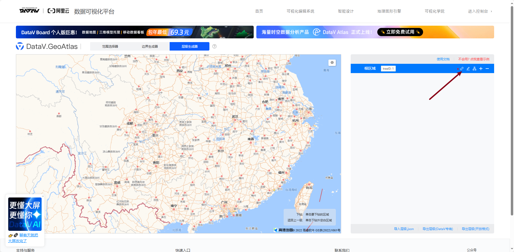
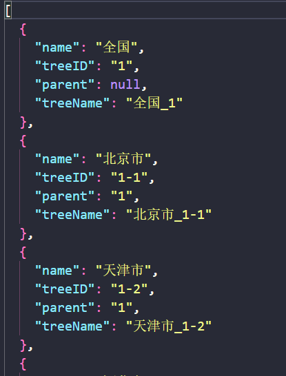
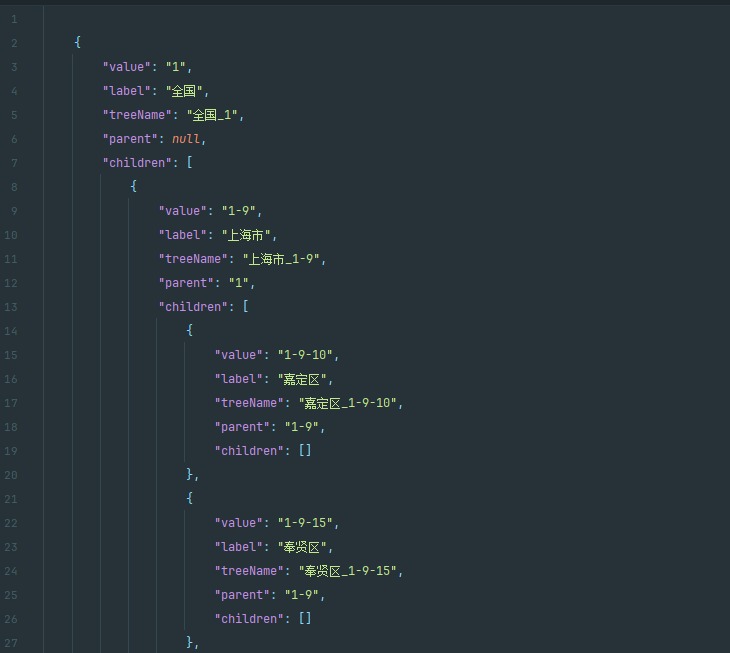

## API

[DataV.GeoAtlas地理小工具系列 (aliyun.com)](https://datav.aliyun.com/portal/school/atlas/level_generator#4.77/108.803225/28.541844)

## 逻辑思路

> 1
>
> 后端直接存储前端传递的字符
>
> 缺点，无法省市区对应起来（找到北京下的，很难进行）

> 2
>
> 前后端使用一套相同的地图数据文件，文件两端各自存储一份
>
> 缺点，前端文件本地储存，使用json格式需要一些库的支持或者不兼容多端（可以通过js文件导出数据对象的方式解决）
>
> 文件一般不小，不好经过小程序审核

> 3
>
> 后端储存数据，前端通过接口访问全部文件，或者用户触发时访问固定区域数据的接口
>
> 缺点，后端逻辑较多

## 拿到数据

> 通过上述网站，使用层级生成器，点击链接到全国，然后点击导出层级（DataV专用）

> 上述步骤生成文件如下，没有层级关系，不是我们想要的结构，使用static文件夹内的mapTo.py进行处理就可以了，或者直接问ai,把什么样子的结构生成什么样子的结构的语句。

> 处理，查看数据使用idea速度较快

> 我们喜欢的文件结构如下

