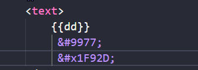

# 关于表情使用和Unicode编码的事

## 文档参考

### Unicode 

[字符编码笔记：ASCII，Unicode 和 UTF-8 - 阮一峰的网络日志 (ruanyifeng.com)](https://www.ruanyifeng.com/blog/2007/10/ascii_unicode_and_utf-8.html)

### 表情使用

[表情符号(Emoji)在Web中的使用 - 前端开发者学堂 - fedev.cn](https://fedev.cn/css/emojis-in-web.html)

### 表情使用的重点

表情的本质是和汉字，字母，各类语言是一样的，都是有一个编码对应的二进制关系的，所以把表情当成汉字。

表情的两大重要因素，实体和Unicode编码，十进制编码

# 在js里面将代码的字符串传给HTML代码是无效的！！！！字符串本质是对象，它会对数据有一些操作
