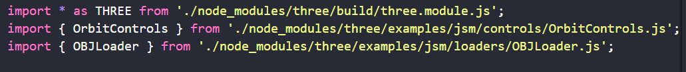

## 模型渲染

# 注意

> three的使用但不是必须的api ->document,window

> WebGLRenderer渲染器api需要接受一个canvas,你得创建这个dom元素，并且通过uni canvas创建方法得到的该dom元素缺乏必要方法无法使用，推荐使用document.createElement，或者使用renderjs来进行app的兼容，可以参考插件市场的three插件

> three需要的api在h5端都是具备的，但是在vue3的情况下会出现一些奇怪问题，建议使用veu2构建

## 在html单文件上面使用测试过程

1.导入需要的js包文件，可以打印观察是否成功导入

注：单文件使用npm下载的包的时候需要注意凡是使用导入了的文件，你需要使用就必须全部更改导入路径。因为npm导入使用的包默认的导入方式路径是基于npm的配置文件的。

注：单文件运行的时候，会出现一个问题，他只会把你运行的html文件上传到浏览器上面去，所以你的导入引用语法将会全部失效！！！这里涉及到了一些架构的知识，所以推荐使用一款框架，在框架内使用单个html文件。你的需要导入的包就会被框架上传到浏览器上面去。你的导入就不会失效！！

## 在uniapp vue2项目上面运行

> canvas dom实例的创建，app端的方案替代是renderjs，npm下载的threes在html使用未发现问题，app可能需要使用兼容uniapp的three包

> 再导入正确的情况下出现一直执行动画然后报错，或者直接报告使用属性为空的问题一般都是作用域和执行顺序的问题

项目参考：./three.js.vue
