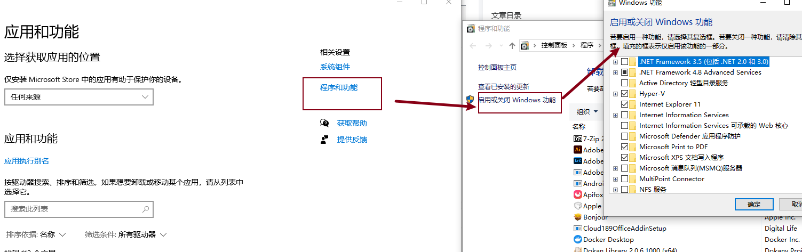

## windows安装，安装版本是4.33

### 1.官网下载dockers_desktop.exe软件

### 2.去github下载汉化包，也可以直接使用./DockerDesktop-CN-master里面直接下载好的，有关使用和地址在该文件阐述的很明白

### 3.如果使用docker默认的方式 wsl的话需要去安装wsl

> 这里需要在下面步骤打开
> 
> 适应于linux的windows子系统
> 
> 虚拟化平台
> 
> Hyper-V 下所有子类

### 4.如果使用wsl方式的话不需要安装wsl直接安装就可以了
