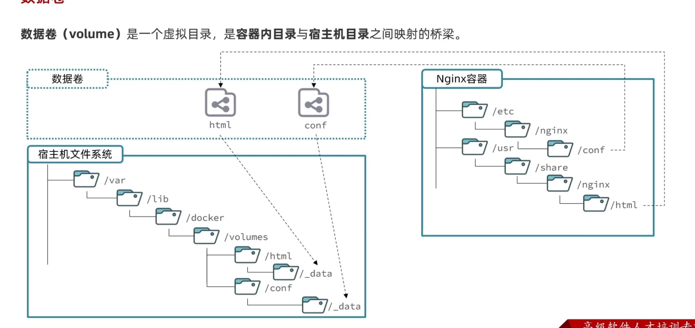
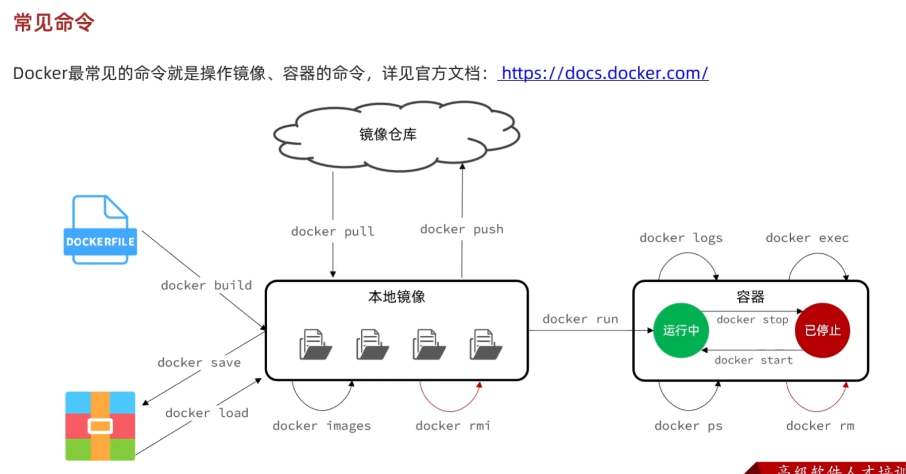

## 概念理解（容器，镜像，数据卷）

### 1.镜像

> 镜像是一个文件系统，有环境，程序，依赖库，配置文件，环境变量等等，每一个镜像都有一个或者多个Dockerfile文件，Dockerfile文件就是一个配置脚本，里面编写了docker的运行命令，
>
> 镜像的层的概念，可以这样理解为文件系统的一级一级一样，

### 2.容器

> 容器和镜像的关系完美符合类和实例的关系，容器是镜像这个模板的实例，容器是一个个最小单位的linux系统，它和虚拟机是类似的

### 3.数据卷

> 数据卷是关联容器内与宿主机的数据的，解决了容器内数据不好保存，难以修改的问题，这个关联是双向的

