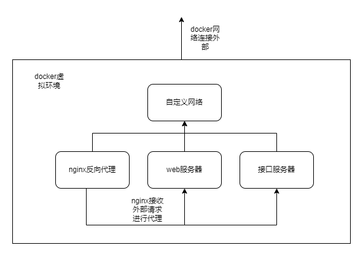
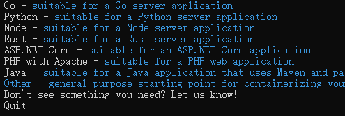

# 概述

#### 项目：使用nginx进行反代理到node配置的web网页服务器和后端接口服务

关系图

## 创建镜像文件（windows下创建）

### 方法1:进入需要创建镜像的文件，进入cmd，使用 docker init回答几个问题，它会根据你的回答给你创建对应的目录。

限制很大，就下面几种类型可以选择

### 方法2,进入你需要创建的目录，然后手动创建目录，目录文件如下

> .dockerignoreg该文件没有名字，作用是排除不需要上传的目录，手动自己删掉也是一样的结果

> compose.yaml这个好像是环境配置文件，不是很常用

> Dockerfile files类型的文件，很重要编写了如何进行配置，文件参考  ./dockerfiles文件参考
>
> ！！！ 向node这种需要下载配置的项目务必把原本的依赖删除，不然会和构建过程中下载的依赖冲突

## 构建打包镜像

使用下面命令构建镜像，最后有一个点表示项目路径不要忘记

> docker build -t my-app:latest .

使用下面命令打包镜像my-node-app.tar可以是目录，这里本来说可以使用容器打包，但是没有成功

> docker save my-node-app:latest > my-node-app.tar

## 在服务器恢复镜像

使用下面命令

> docker load -i my-node-app.tar

## 创建自定义网络

1. 创建一个默认的桥接网络

> docker network create my-net

这将创建一个名为`my-net`的默认桥接网络。

#### 2. 创建一个带子网和网关的桥接网络

> docker network create --driver bridge --subnet 172.18.0.0/16 --gateway 172.18.0.1 my-custom-net

这将创建一个名为`my-custom-net`的桥接网络，子网地址范围为`172.18.0.0/16`，网关地址为`172.18.0.1`。

## 运行镜像

* 分配端口`8080`到容器内的`80`端口；
* 连接到名为`my-network`的自定义网络；
* 分配IP地址`172.18.0.4`给容器；
* 将宿主机的`/mnt/data`目录挂载到容器内的`/data`目录。

可以使用以下命令：

> docker run -d
>   --name my-container
> --network my-network
> --ip 172.18.0.4
> -p 8080:80
> -v /mnt/data:/data
> my-image
