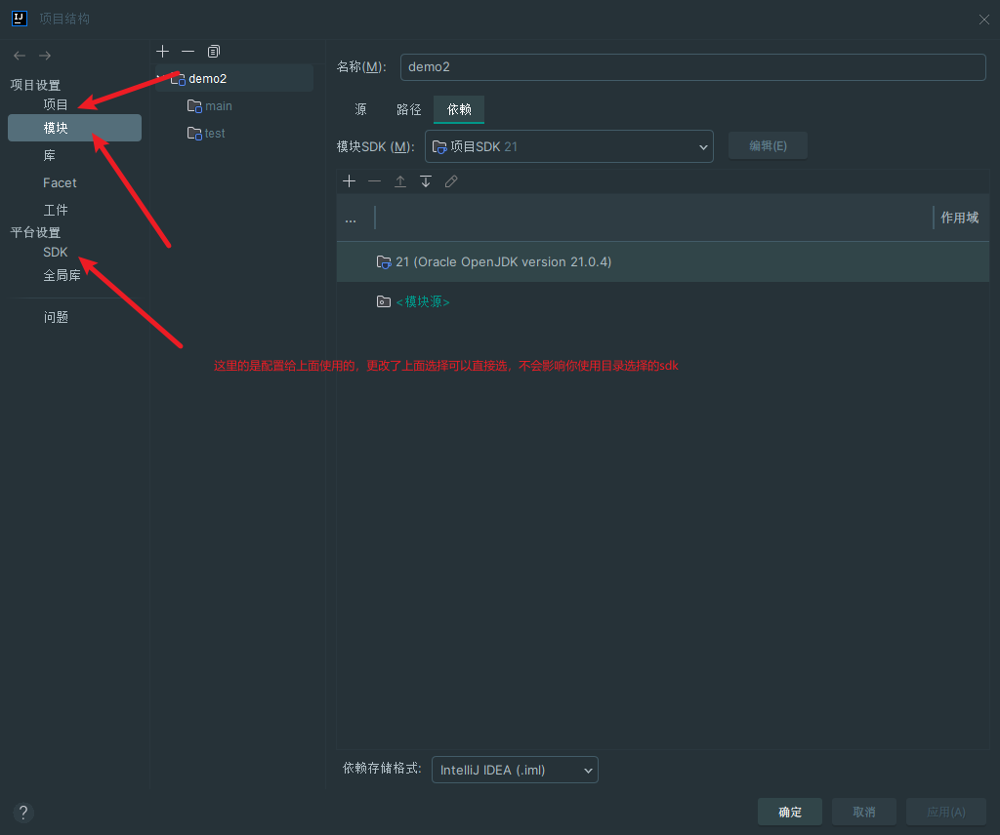
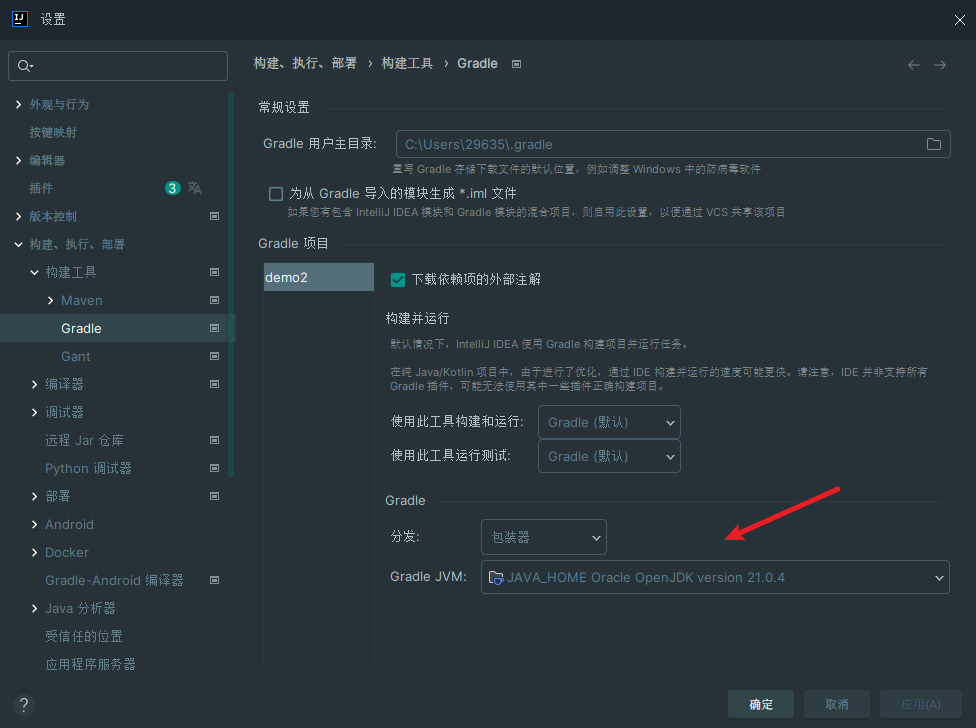
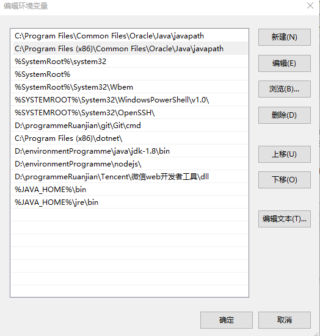

# sping boot项目创建

> creationTime: 2024/08/16

目的：进行接口试探

遇见问题：在jdk本地是1.8的情况下，该项目模板最低支持17.在项目上选择下载的jdk 2.1包之后报告，jvm使用的是原先电脑上的1.8的jvm。

解决办法：因为1.8之后的版本，不会在jdk中包含jre环境包。需要使用命令自己下载

> 在jdk目录下输入 bin\jlink.exe --module-path jmods --add-modules java.desktop --output jre 进行下载jre

#### ！！项目的模块结构/项目结构的模块，项目的sdk和使用的构建工具的sdk版本记得进行配置

可能的解决办法：在环境变量中配置jdk的bin和jre的bin，path中是关键

## API

[jdk没有jre的解决方法\_新版jdk没有jre-CSDN博客](https://blog.csdn.net/weixin_45729500/article/details/110509807)
