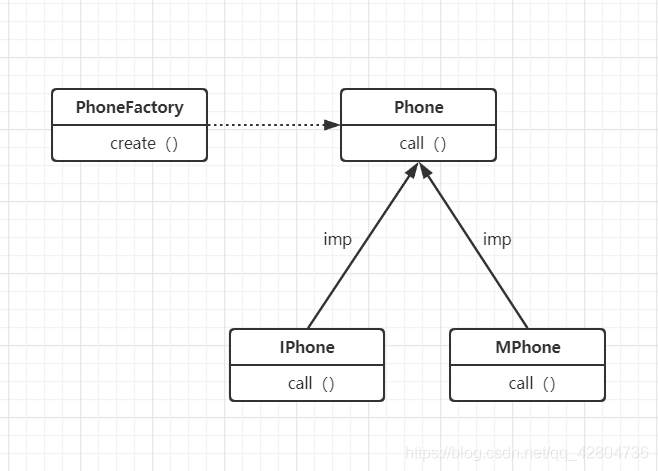

# 接口/抽象类

### 关键字- `interface`

## 实现关键字-`implements`

## 描述

> 接口（Interface）是一种完全抽象的类，它不能直接实例化，只能通过实现它的类来间接使用。接口定义了一组抽象方法，这些方法没有具体的实现(没有方法体)，只有方法签名。实现接口的类必须提供这些抽象方法的具体实现。如果无法全部实现就必须声明为抽象类。且不能实例化。接口可以用来定义对象的行为规范，使得不同类的对象可以以统一的方式被处理。接口可以被多实现。

```java
public interface hello {
    // 静态方法（Java 8 及以上版本）
    static void speak() {
        System.out.println("Speaking...");
    }
    // 默认方法（Java 8 及以上版本）
    default void move() {
        System.out.println("hello");
    }
    // 抽象方法
    abstract String hello2();
    // 抽象方法 接口内默认方法是抽象的abstract是可以省略的
    void  hello3 ();
}
interface cat {
    void eat();
}
```

```java
class Dog implements hello,cat {

    @Override
    public String hello2() {
        System.out.println("Dog is eating...");
        return "Dog";
    }

    @Override
    public void hello3() {
        System.out.println("Dog is sleeping...");
    }
    // 可以选择性地重写默认方法
    @Override
    public void move() {
        System.out.println("Dog is running...");
    }
    public void eat(){
        System.out.println("Dog is eating...");
    }
}
```

# 抽象

## 关键字-`abstract`

## 注解关键字-`@Override`

## 描述

> 抽象具备抽象类（Abstract Class）和抽象方法（Abstract Method）。抽象的意思就是这个对象是抽象的，你不能直接理解，就像梵高的星空，每个人心中的不一样的哈姆雷特，可以具备不一样的内在（方法体）。抽象方法即没有方法体的方法，抽象类就是具备抽象方法的类。具备没有方法体的方法（抽象方法）的类无法实例。——没有自己对星空的理解怎么可能可以给别人说清楚梵高的星空的呢？

抽象方法

> 抽象方法是没有实现的方法，即没有方法体。抽象方法必须在抽象类中定义。任何继承抽象类的非抽象子类都必须实现所有的抽象方法，除非子类也是抽象的。

```java
public abstract void eat();
    @Override
public String eat() {
        System.out.println("Dog is eating...");
        return "Dog";
}
```

抽象类

> 抽象类是不能被实例化的类，也就是说，你不能创建抽象类的对象。抽象类通常用于表示一些基础类，这些基础类本身不完整，或者说是不具体的(抽象方法)它们的存在主要是为了提供一些子类可以继承的方法和属性。

```java
public abstract class Animal {
    // 抽象方法
    public abstract void eat();

    // 普通方法
    public void breathe() {
        System.out.println("Breathing...");
    }
}
//实现
public class Dog extends Animal {
    @Override
    public void eat() {
        System.out.println("Dog is eating...");
    }
}
```

## 和接口的区别

> - **抽象类** 可以有构造函数，而接口不能有构造函数。
> - **抽象类** 可以包含已实现的方法和成员变量，而接口中的方法默认都是抽象的（Java 8 之后可以有默认方法和静态方法），并且接口中的成员变量默认是 `public static final` 的。
> - 一个类只能继承一个抽象类，但可以实现多个接口。

# 静态

## 关键字-`static`

## 描述

> `static` 关键字用于声明静态成员（包括静态变量和静态方法,静态块）。静态成员属于类本身，而不是类的实例。这意味着无论创建多少个类的实例，静态成员在内存中都只有一份拷贝。静态成员的主要用途是实现类级别的共享数据和行为。

### 静态变量（Static Variable）

静态变量也称为类变量，它在类的所有实例之间共享。静态变量在类加载时初始化，并且在整个程序运行期间都存在。

#### 定义静态变量

```java
public class Counter {
    public static int count = 0; // 静态变量

    public Counter() {
        count++; // 每次创建一个 Counter 实例时，count 自增
    }

    public static void printCount() {
        System.out.println("Total instances: " + count);
    }
//入口文件，测试使用的
    public static void main(String[] args) {
        Counter c1 = new Counter();
        Counter c2 = new Counter();
        Counter.printCount(); // 输出: Total instances: 2
    }
}
```

在这个例子中，`count` 是一个静态变量，它记录了 `Counter` 类的实例数量。每次创建一个新的 `Counter` 实例时，`count` 都会增加。`printCount` 是一个静态方法，用于打印当前的实例数量。

### 静态方法（Static Method）

关联性：静态方法与类本身相关，而实例方法与类的实例相关。

调用方式：静态方法通过类名调用，而实例方法需要通过对象实例来调用。

访问权限：静态方法可以访问类的静态成员，但不能访问非静态成员（实例成员）。实例方法可以访问类的静态和非静态成员。

内部引用：静态方法中不能使用this关键字，因为它没有当前对象的引用。实例方法可以使用this来引用当前对象。

生命周期：静态方法在类加载时初始化，而实例方法在对象创建时初始化。

```java
public class MathUtils {
    public static int add(int a, int b) {
        return a + b;
    }

    public static int subtract(int a, int b) {
        return a - b;
    }
//入口文件，测试使用的
    public static void main(String[] args) {
        int sum = MathUtils.add(10, 5); // 直接通过类名调用静态方法
        int difference = MathUtils.subtract(10, 5);
        System.out.println("Sum: " + sum); // 输出: Sum: 15
        System.out.println("Difference: " + difference); // 输出: Difference: 5
    }
}
```

在这个例子中，`MathUtils` 类定义了两个静态方法 `add` 和 `subtract`，这些方法可以直接通过类名调用，而不需要创建 `MathUtils` 的实例。

### 静态块（Static Block）

静态块用于初始化静态变量，它在类加载时执行，且只执行一次。静态块通常用于复杂的初始化逻辑。

#### 定义静态块

```java
public class DatabaseConnection {
    public static String url;
    public static String username;
    public static String password;

    static {
        // 初始化静态变量
        url = "jdbc:mysql://localhost:3306/mydb";
        username = "root";
        password = "password";
    }

    public static void printConnectionDetails() {
        System.out.println("URL: " + url);
        System.out.println("Username: " + username);
        System.out.println("Password: " + password);
    }
//入口文件，测试使用的
    public static void main(String[] args) {
        DatabaseConnection.printConnectionDetails();
    }
}
```

在这个例子中，静态块用于初始化 `DatabaseConnection` 类的静态变量 `url`、`username` 和 `password`。这些变量在类加载时被初始化，并且可以通过类名访问。

### 总结

- **静态变量**：类级别的变量，所有实例共享同一份数据。
- **静态方法**：类级别的方法，可以直接通过类名调用，不能访问非静态成员。
- **静态块**：用于初始化静态变量，类加载时执行一次。

# 公有

## 关键字-`public`

## 描述

> `public` 是一个访问修饰符，用于控制类、方法、变量和构造器的可见性和访问级别。`public` 访问修饰符是最宽松的访问级别，表示被修饰的成员可以在任何地方被访问。

### 公有类（Public Class）

一个类可以被声明为 `public`，这意味着该类可以在任何地方被访问。在一个 `.java` 文件中，最多只能有一个 `public` 类，并且文件名必须与 `public` 类的名称相同。

```java
public class MyClass {
    // 类的内容
}
```

### 公有方法（Public Method）

`public` 方法可以在任何地方被访问，包括类的外部和其他包中的类。

```java
public class MyClass {
    public void myMethod() {
        // 方法的内容
    }
}
```

### 公有变量（Public Variable）

`public` 变量可以在任何地方被访问，包括类的外部和其他包中的类。虽然可以这样做，但通常不建议将变量声明为 `public`，因为这会破坏封装性，降低代码的安全性和可维护性。

```java
public class MyClass {
    public int myVariable;

    public MyClass(int value) {
        myVariable = value;
    }
}
```

### 公有构造器（Public Constructor）

`public` 构造器可以在任何地方被调用，用于创建类的实例。

```java
public class MyClass {
    public MyClass() {
        // 构造器的内容
    }
}
```

# 私有

## 关键词-`private`

## 描述

> `private` 是一个访问修饰符，用于限制类、方法、变量和构造器的可见性和访问级别。`private` 访问修饰符是最严格的访问级别，表示被修饰的成员只能在声明它的类内部访问。其他类（包括子类）无法直接访问 `private` 成员。

### 私有变量（Private Variable）

私有变量只能在声明它的类内部访问。这有助于封装类的内部状态，防止外部直接修改这些变量，从而提高代码的安全性和可维护性。

```java
public class Person {
    private String name; // 私有变量
    private int age;     // 种有变量

    // 构造器
    public Person(String name, int age) {
        this.name = name;
        this.age = age;
    }

    // Getter 方法
    public String getName() {
        return name;
    }

    // Setter 方法
    public void setName(String name) {
        this.name = name;
    }

    // Getter 方法
    public int getAge() {
        return age;
    }

    // Setter 方法
    public void setAge(int age) {
        if (age > 0) {
            this.age = age;
        } else {
            System.out.println("Age must be positive.");
        }
    }
}
```

### 私有方法（Private Method）

私有方法只能在声明它的类内部访问。这有助于隐藏实现细节，防止外部调用这些方法。

```java
public class Calculator {
    // 私有方法
    private int add(int a, int b) {
        return a + b;
    }

    // 公有方法，调用私有方法
    public int calculateSum(int a, int b) {
        return add(a, b);
    }
}
```

### 私有构造器（Private Constructor）

私有构造器只能在声明它的类内部访问。这通常用于单例模式，确保类只有一个实例。

```java
public class Singleton {
    private static Singleton instance;

    // 私有构造器
    private Singleton() {
        // 初始化代码
    }

    // 获取实例的方法
    public static Singleton getInstance() {
        if (instance == null) {
            instance = new Singleton();
        }
        return instance;
    }

    // 其他方法
    public void doSomething() {
        System.out.println("Doing something...");
    }
} 
```

# 访问可见性

**Java 中有四种访问控制修饰符，按访问权限从宽到窄依次为：**

1. **`public`**：最宽松的访问级别，可以在任何地方被访问。
2. **`protected`**：可以在同一个包内或子类中访问。
3. **无修饰符（包私有）**：只能在同一个包内访问。
4. **`private`**：最严格的访问级别，只能在同一个类内访问。

**最佳实践**

- **封装性**：尽量将变量声明为 `private`，并通过 `public` 方法（如 getter 和 setter）来访问和修改变量，以保护类的内部状态。
- **接口**：将类的公共方法声明为 `public`，以提供对外的接口。
- **构造器**：如果类需要被外部实例化，通常将构造器声明为 `public`。

# 继承

## 关键字-`extends`

## 不想被继承和重写关键字-`final`

## 调用父类的关键字-`super`

## 描述

> 继承是一种面向对象编程的核心概念，它允许一个类（子类或派生类）继承另一个类（父类或基类）的属性和方法。通过继承，子类可以获得父类的非私有成员（方法和变量），并且可以添加新的方法和变量，或者重写父类的方法以实现不同的行为。

### 基本语法

使用 `extends` 关键字来实现继承。以下是一个简单的继承示例：

```java
// 父类
public class Animal {
    protected String name;

    public Animal(String name) {
        this.name = name;
    }

    public void eat() {
        System.out.println(name + " is eating.");
    }

    public void sleep() {
        System.out.println(name + " is sleeping.");
    }
}

// 子类
public class Dog extends Animal {
    public Dog(String name) {
        super(name); // 调用父类的构造器
    }

    // 重写父类的方法
    @Override
    public void eat() {
        System.out.println(name + " is eating dog food.");
    }

    // 新增的方法
    public void bark() {
        System.out.println(name + " is barking.");
    }
}

// 测试类
public class Test {
    public static void main(String[] args) {
        Dog dog = new Dog("Buddy");
        dog.eat();   // 输出: Buddy is eating dog food.
        dog.sleep(); // 输出: Buddy is sleeping.
        dog.bark();  // 输出: Buddy is barking.
    }
}
```

### 关键点

1. **继承关键字**：使用 `extends` 关键字来指定子类继承父类。
2. **构造器**：子类可以通过 `super` 关键字调用父类的构造器来初始化继承的属性。
3. **方法重写**：子类可以使用 `@Override` 注解来重写父类的方法，以实现不同的行为。
4. **新增方法和属性**：子类可以添加新的方法和属性，以扩展父类的功能。

### 多级继承

Java 支持多级继承，即一个类可以继承另一个类，而这个类又可以继承另一个类。例如：

```java
public class Animal {
    protected String name;

    public Animal(String name) {
        this.name = name;
    }

    public void eat() {
        System.out.println(name + " is eating.");
    }

    public void sleep() {
        System.out.println(name + " is sleeping.");
    }
}

public class Mammal extends Animal {
    public Mammal(String name) {
        super(name);
    }

    public void giveBirth() {
        System.out.println(name + " gives birth to live young.");
    }
}

public class Dog extends Mammal {
    public Dog(String name) {
        super(name);
    }

    @Override
    public void eat() {
        System.out.println(name + " is eating dog food.");
    }

    public void bark() {
        System.out.println(name + " is barking.");
    }
}

public class Test {
    public static void main(String[] args) {
        Dog dog = new Dog("Buddy");
        dog.eat();       // 输出: Buddy is eating dog food.
        dog.sleep();     // 输出: Buddy is sleeping.
        dog.bark();      // 输出: Buddy is barking.
        dog.giveBirth(); // 输出: Buddy gives birth to live young.
    }
}
```

### 注意事项

1. **单一继承**：Java 不支持多继承（一个类不能继承多个类），但可以通过实现多个接口来达到类似的效果。
2. **方法重写**：重写父类的方法时，子类的方法签名必须与父类的方法签名完全一致。
3. **构造器调用顺序**：子类的构造器会首先调用父类的构造器，然后执行自己的构造器逻辑。
4. **`final` 类和方法**：使用 `final` 关键字修饰的类不能被继承，使用 `final` 关键字修饰的方法不能被重写。

## 接口的多继承/实现

## 描述

> 接口的多继承（或更准确地说，多实现）是一个非常有用的功能。一个类可以实现多个接口，从而获得多个接口中定义的方法和常量。这与类的单继承不同，类的单继承意味着一个类只能继承一个父类，而接口的多实现则没有这样的限制。

### 接口的多实现

一个类可以通过 `implements` 关键字来实现多个接口。实现多个接口的类必须提供所有接口中定义的抽象方法的具体实现。

#### 示例

假设我们有两个接口 `Flyable` 和 `Swimmable`，分别定义了飞行和游泳的行为。我们可以创建一个类 `Duck`，它既会飞也会游泳。

```java
// 接口 Flyable
public interface Flyable {
    void fly();
}

// 接口 Swimmable
public interface Swimmable {
    void swim();
}

// 类 Duck 实现 Flyable 和 Swimmable 接口
public class Duck implements Flyable, Swimmable {
    @Override
    public void fly() {
        System.out.println("Duck is flying.");
    }

    @Override
    public void swim() {
        System.out.println("Duck is swimming.");
    }

    public void quack() {
        System.out.println("Duck is quacking.");
    }
}

// 测试类
public class Test {
    public static void main(String[] args) {
        Duck duck = new Duck();
        duck.fly();   // 输出: Duck is flying.
        duck.swim();  // 输出: Duck is swimming.
        duck.quack(); // 输出: Duck is quacking.
    }
}
```

### 接口的继承

接口也可以继承其他接口，这类似于类的继承。一个接口可以继承多个接口，使用逗号分隔。

#### 示例

假设我们有一个接口 `Movable`，它定义了移动的行为。我们可以让 `Flyable` 和 `Swimmable` 接口都继承 `Movable` 接口。

```java
// 接口 Movable
public interface Movable {
    void move();
}

// 接口 Flyable 继承 Movable
public interface Flyable extends Movable {
    void fly();
}

// 接口 Swimmable 继承 Movable
public interface Swimmable extends Movable {
    void swim();
}

// 类 Duck 实现 Flyable 和 Swimmable 接口
public class Duck implements Flyable, Swimmable {
    @Override
    public void fly() {
        System.out.println("Duck is flying.");
    }

    @Override
    public void swim() {
        System.out.println("Duck is swimming.");
    }

    @Override
    public void move() {
        System.out.println("Duck is moving.");
    }

    public void quack() {
        System.out.println("Duck is quacking.");
    }
}

// 测试类
public class Test {
    public static void main(String[] args) {
        Duck duck = new Duck();
        duck.fly();   // 输出: Duck is flying.
        duck.swim();  // 输出: Duck is swimming.
        duck.move();  // 输出: Duck is moving.
        duck.quack(); // 输出: Duck is quacking.
    }
}
```

### 注意事项

1. **方法实现**：实现多个接口的类必须提供所有接口中定义的抽象方法的具体实现。
2. **方法冲突**：如果多个接口中有同名的方法，实现类只需要提供一个方法实现即可。
3. **默认方法和静态方法**：从 Java 8 开始，接口可以包含默认方法和静态方法。如果多个接口中有同名的默认方法，实现类必须重写该方法以解决冲突。
4. **继承层次**：接口的继承层次可以很复杂，但最终实现类必须提供所有抽象方法的具体实现。

### 解决方法冲突

如果多个接口中有同名的默认方法，实现类必须重写该方法以解决冲突。例如：

```java
// 接口 InterfaceA
public interface InterfaceA {
    default void sayHello() {
        System.out.println("Hello from InterfaceA");
    }
}

// 接口 InterfaceB
public interface InterfaceB {
    default void sayHello() {
        System.out.println("Hello from InterfaceB");
    }
}

// 类 MyClass 实现 InterfaceA 和 InterfaceB
public class MyClass implements InterfaceA, InterfaceB {
    @Override
    public void sayHello() {
        // 选择一个接口的方法实现
        InterfaceA.super.sayHello();
        // 或者
        // InterfaceB.super.sayHello();
    }

    public static void main(String[] args) {
        MyClass obj = new MyClass();
        obj.sayHello(); // 输出: Hello from InterfaceA
    }
}
```

## 工厂模式，抽象工厂，工厂方法，简单工厂

## 描述

> 见名知意，什么工厂就是返回什么的实例对象，核心本质就是不需要通过new来实例化对象，用工厂方法来实例化对象。使用工厂统一创建管理对象的创建，将调用和实现解耦（分开）

## 简单工厂

建立一个工厂类，对实现了同一接口的一些类进行实例的创建。

手机工厂示例



手机接口类

```java
public interface Phone {
    public void call();
}
```

不同手机实现类

```java
public class IPhone implements Phone{
    @Override
    public void call() {
        System.out.println("用苹果手机打电话！");
    }
}
public class MPhone implements Phone{
    @Override
    public void call() {
        System.out.println("用小米手机打电话！");
    }
}
```

# 封装

## 描述

封装就是把本来外部可以访问的路全部封死，只留下一些接口给外部进行访问。主要通过控制可见性将类的内部数据（属性）设置为私有（`private`），防止外部代码直接访问和修改这些数据。这可以避免因外部代码的误操作而导致的数据不一致或错误。

## 封装的好处：

> 1. 提高代码的安全性，保护数据。
> 2. 隐藏代码的实现细节。
> 3. 统一接口。
> 4. 提高了系统的可维护性。

未封装前

```java
import java.util.*;
class Member {
    public String name;//公共属性name
    public int salary;//公共属性salary
    public int sex;//公有属性sex

}
public class Demo {
    public static void main(String[] args) {
        Member m=new Member();
        m.name="小红";//对公共属性name直接赋值
        m.salary = 100000;
        m.sex = 24;
    }
}
```

封装之后

```java
import java.util.*;
class Young {
    private String name;
    private int age;
    private String major;
    public void setName(String name) {
        this.name=name;
    }
        public void setAge(int age) {
        this.age=age;
    }
    public void setMajor(String major) {
        this.major=major;
    }
    public String getName() {
        return this.name;
    }
    public int getAge() {
        return this.age;
    }
    public String getMajor() {
        return this.major;
    }
}
public class Forever {
    public static void main(String[] args) {
        Young member=new Young();
        member.setName("张三");
        member.setAge(20);
        member.setMajor("计算机科学与技术");
        System.out.println("学生姓名:"+member.getName()+
                  ",年龄:"+member.getAge()+
                  ",专业:"+member.getMajor()+"!");
    }
}
```

# 多态

## 描述

多态是指，针对某个类型的方法调用，其真正执行的方法取决于运行时期实际类型（是谁的实例）的方法 Person p = new Student(); p运行时是Student的实例，所有使用的方法在Student被重写的时候使用Student的

假设我们定义一种收入，需要给它报税，那么先定义一个`Income`类：

```java
class Income {
    protected double income;
    public double getTax() {
        return income * 0.1; // 税率10%
    }
}
```

对于工资收入，可以减去一个基数，那么我们可以从`Income`派生出`SalaryIncome`，并覆写`getTax()`：

```java
class Salary extends Income {
    @Override
    public double getTax() {
        if (income <= 5000) {
            return 0;
        }
        return (income - 5000) * 0.2;
    }
}
```

如果你享受国务院特殊津贴，那么按照规定，可以全部免税：

```java
class StateCouncilSpecialAllowance extends Income {
    @Override
    public double getTax() {
        return 0;
    }
}
```

现在，我们要编写一个报税的财务软件，对于一个人的所有收入进行报税，可以这么写：

```java
public double totalTax(Income... incomes) {
    double total = 0;
    for (Income income: incomes) {
        total = total + income.getTax();
    }
    return total;
}
```

来试一下：

```java
// Polymorphic
public class Main {
    public static void main(String[] args) {
        // 给一个有普通收入、工资收入和享受国务院特殊津贴的小伙伴算税:
        Income[] incomes = new Income[] {
            new Income(3000),
            new Salary(7500),
            new StateCouncilSpecialAllowance(15000)
        };
        System.out.println(totalTax(incomes));
    }

    public static double totalTax(Income... incomes) {
        double total = 0;
        for (Income income: incomes) {
            total = total + income.getTax();
        }
        return total;
    }
}

class Income {
    protected double income;

    public Income(double income) {
        this.income = income;
    }

    public double getTax() {
        return income * 0.1; // 税率10%
    }
}

class Salary extends Income {
    public Salary(double income) {
        super(income);
    }

    @Override
    public double getTax() {
        if (income <= 5000) {
            return 0;
        }
        return (income - 5000) * 0.2;
    }
}

class StateCouncilSpecialAllowance extends Income {
    public StateCouncilSpecialAllowance(double income) {
        super(income);
    }

    @Override
    public double getTax() {
        return 0;
    }
}
```

观察`totalTax()`方法：利用多态，`totalTax()`方法只需要和`Income`打交道，它完全不需要知道`Salary`和`StateCouncilSpecialAllowance`的存在，就可以正确计算出总的税。如果我们要新增一种稿费收入，只需要从`Income`派生，然后正确覆写`getTax()`方法就可以。把新的类型传入`totalTax()`，不需要修改任何代码。

可见，多态具有一个非常强大的功能，就是允许添加更多类型的子类实现功能扩展，却不需要修改基于父类的代码。

# 构造方法

## 描述

构造方法（Constructor）是类中的一种特殊方法，用于在创建对象时初始化对象的状态。构造方法的名字必须与类名相同，并且没有返回类型（连 `void` 也没有）。构造方法的主要作用是在创建对象时为对象的属性赋初值。

### 构造方法的特点

1. **名字与类名相同**：构造方法的名字必须与类名完全相同。
2. **没有返回类型**：构造方法没有返回类型，甚至没有 `void`。调用构造方法，必须用`new`操作符。
3. **可以有参数**：构造方法可以有参数，用于传递初始值。
4. **可以重载**：一个类可以有多个构造方法，只要它们的参数列表不同（参数的数量、类型或顺序不同）。
5. **默认构造方法**：如果类中没有定义任何构造方法，Java 编译器会自动提供一个无参的默认构造方法。一旦定义了构造方法，编译器就不会再提供默认构造方法。
6. 没有在构造方法中初始化字段时，引用类型的字段默认是`null`，数值类型的字段用默认值，`int`类型默认值是`0`，布尔类型默认值是`false`：

## 示例

默认构造方法

```java
class Person {
    public Person() {
    }
}
```

```java
// 构造方法
public class Main {
    public static void main(String[] args) {
        Person p1 = new Person("Xiao Ming", 15); // 既可以调用带参数的构造方法
        Person p2 = new Person(); // 也可以调用无参数构造方法
    }
}

class Person {
    private String name;
    private int age;

    public Person() {
    }

    public Person(String name, int age) {
        this.name = name;
        this.age = age;
    }

    public String getName() {
        return this.name;
    }

    public int getAge() {
        return this.age;
    }
}
```

# 内部类

## 描述

不处于文件根上下文的类，参考方法内的方法，环境由它所处的上下文决定

### 内部类的优点

1. **封装性**：内部类可以访问外部类的所有成员，包括私有成员，增强了封装性。
2. **代码组织**：内部类可以将相关的代码组织在一起，提高代码的可读性和可维护性。
3. **实现回调**：内部类特别适合实现回调接口，例如事件处理。
4. **简化代码**：匿名内部类可以简化代码，特别是在需要实现接口或继承类的场景中。

### 内部类的注意事项

1. **成员内部类**：成员内部类的实例依赖于外部类的实例。
2. **局部内部类**：局部内部类只能在定义它的方法或作用域内使用。
3. **匿名内部类**：匿名内部类没有名字，通常用于实现接口或继承类。
4. **静态内部类**：静态内部类不依赖于外部类的实例，可以直接通过外部类名访问。

# 入口

## 描述

## 描述

程序的入口点是 `main` 方法。`main` 方法是 Java 应用程序的起点，当程序启动时，JVM 会查找并执行 `main` 方法。`main` 方法的签名是固定的

## 特性

1. **公共访问权限（`public`）**：`main` 方法必须是公共的，以便 JVM 可以访问它。
2. **静态方法（`static`）**：`main` 方法必须是静态的，因为 JVM 在调用 `main` 方法时不会创建类的实例。
3. **返回类型为 `void`**：`main` 方法没有返回值。
4. **参数类型为 `String[]/String...`**：`main` 方法接受一个字符串数组作为参数，用于接收命令行参数。

# 枚举类型

## 关键字-`enum`

## 描述

枚举类型使用 `enum` 关键字定义。枚举常量之间用逗号分隔，最后一个常量后面可以不加逗号。

### 枚举类型的优点

1. **类型安全**：枚举类型提供了一种类型安全的方式来表示一组固定的常量。
2. **可读性强**：使用枚举类型可以使代码更具可读性，避免使用魔法值。
3. **防止错误**：枚举类型可以防止使用未定义的值，提高代码的健壮性。
4. **可扩展性**：枚举类型可以包含方法和字段，使其具有更复杂的行为。

#### 枚举方法

枚举类型提供了许多有用的方法，例如 `values()`、`valueOf()` 和 `ordinal()`。

- **`values()`**：返回枚举类型的常量数组。
- **`valueOf()`**：根据字符串值返回对应的枚举常量。
- **`ordinal()`**：返回枚举常量的索引位置（从 0 开始）。

### 枚举类型的注意事项

1. **不可变性**：枚举常量是不可变的，一旦创建就不能改变。
2. **线程安全**：枚举类型是线程安全的，因为它们是单例的。
3. **自定义自己的方法**，那么必须在enum实例序列的最后添加一个分号。
4. 枚举类型隐式继承自 `java.lang.Enum` 类，因此不能显式继承其他类。但是，枚举类型可以实现接口。
5. **枚举类型的实例化**：枚举常量在类加载时自动创建，每个枚举常量都是唯一的实例。
6. **静态成员**：枚举类型可以包含静态成员（静态变量和静态方法），这些成员在整个枚举类型中共享，并在类加载时初始化。
7. **序列化**：枚举类型支持序列化，可以用于在网络传输或持久化存储中。

### 枚举类型的实例化

枚举类型的实例化是由编译器自动完成的，你不需要手动创建枚举实例。枚举常量在类加载时就已经被创建，并且是单例的。每个枚举常量都是该枚举类型的唯一实例。

#### 示例

```java
public enum Day {
    SUNDAY, MONDAY, TUESDAY, WEDNESDAY, THURSDAY, FRIDAY, SATURDAY
}
```

在这个例子中，`SUNDAY`, `MONDAY`, `TUESDAY`, `WEDNESDAY`, `THURSDAY`, `FRIDAY`, `SATURDAY` 都是 `Day` 枚举类型的实例。这些实例在类加载时自动创建，并且是唯一的。

### 枚举类型的静态成员

枚举类型可以包含静态成员，这些静态成员在整个枚举类型中共享。静态成员在类加载时初始化，且只初始化一次。

#### 示例

```java
public enum Color {
    RED("红色"), GREEN("绿色"), BLUE("蓝色");

    private String chineseName;

    // 静态成员
    private static final int COUNT = 3;

    // 构造方法
    Color(String chineseName) {
        this.chineseName = chineseName;
    }

    // Getter 方法
    public String getChineseName() {
        return chineseName;
    }

    // 静态方法
    public static int getCount() {
        return COUNT;
    }

    // 静态块
    static {
        System.out.println("枚举类型加载时执行静态块");
    }
}

public class TestEnum {
    public static void main(String[] args) {
        Color color = Color.RED;
        System.out.println("Color: " + color + ", Chinese Name: " + color.getChineseName());

        // 访问静态成员
        System.out.println("Count of colors: " + Color.getCount());
    }
}
```

### 详细解释

1. **静态成员**：
   
   - **静态变量**：`private static final int COUNT = 3;` 是一个静态变量，它在整个枚举类型中共享。静态变量在类加载时初始化，且只初始化一次。
   - **静态方法**：`public static int getCount() { return COUNT; }` 是一个静态方法，可以通过枚举类型直接调用，而不需要创建枚举实例。

2. **静态块**：
   
   - `static { System.out.println("枚举类型加载时执行静态块"); }` 是一个静态初始化块，它在类加载时执行，且只执行一次。静态块通常用于初始化静态成员。

### 枚举类型的实例化过程

1. **类加载**：当枚举类型第一次被使用时，类加载器会加载该枚举类型。
2. **静态成员初始化**：在类加载过程中，静态成员（静态变量和静态块）会被初始化。
3. **枚举常量创建**：枚举常量在类加载时被创建，调用枚举类型的构造方法进行初始化。
4. **实例可用**：枚举常量创建完成后，它们就可以被使用了。

### 示例解析

```java
public class TestEnum {
    public static void main(String[] args) {
        Color color = Color.RED;
        System.out.println("Color: " + color + ", Chinese Name: " + color.getChineseName());

        // 访问静态成员
        System.out.println("Count of colors: " + Color.getCount());
    }
}
```

1. **创建枚举实例**：
   - `Color color = Color.RED;` 这里 `RED` 是 `Color` 枚举类型的一个实例。由于枚举实例在类加载时已经创建，这里只是引用已存在的实例。
2. **访问静态成员**：
   - `System.out.println("Count of colors: " + Color.getCount());` 这里通过 `Color` 枚举类型直接调用静态方法 `getCount`，返回静态变量 `COUNT` 的值。

# 泛型

## 关键字-`<？>`

## 描述

泛型（Generics）是 Java 语言中的一个重要特性，它允许你在定义类、接口和方法时使用类型参数。通过泛型，可以编写更加灵活和类型安全的代码，避免类型转换的麻烦和潜在的运行时错误。

### 泛型的基本概念

1. **类型参数**：在定义类、接口或方法时，可以使用类型参数来表示未知的类型。
2. **类型实参**：在使用泛型类、接口或方法时，需要指定具体的类型实参。
3. **类型擦除**：Java 编译器在编译时会进行类型擦除，将泛型类型转换为原始类型（即去掉类型参数）。

### 泛型的使用场景

1. **泛型类**：定义一个可以处理多种类型的类。
2. **泛型接口**：定义一个可以处理多种类型的接口。
3. **泛型方法**：定义一个可以处理多种类型的静态或实例方法。
4. **泛型集合**：使用泛型来增强集合类的类型安全性和灵活性。

### 泛型的限制

1. **不能使用基本类型**：泛型只能使用引用类型，不能使用基本类型。例如，`List<int>` 是不允许的，但 `List<Integer>` 是允许的。
2. **类型擦除**：编译器在编译时会进行类型擦除，将泛型类型转换为原始类型。例如，`List<String>` 会被转换为 `List`。
3. **不能创建泛型数组**：不能创建泛型数组，例如 `new T[10]` 是不允许的，但可以通过其他方式绕过这个限制。

### 通配符

通配符（Wildcards）用于表示未知的类型，主要有三种形式：

1. **无界通配符**：`?` 表示未知类型。
2. **参数通配符**：`任意字符`表示引用。
3. **上界通配符**：`? extends T` 表示类型是 `T` 或 `T` 的子类型。
4. **下界通配符**：`? super T` 表示类型是 `T` 或 `T` 的父类型。

## 示例

```java

public class Wildcards {
    public static void printList(List<?> list) {
        for (Object obj : list) {
            System.out.println(obj);
        }
    }

    public static void addNumbers(List<? super Integer> list) {
        list.add(1);
        list.add(2);
    }

    public static void main(String[] args) {
        List<String> stringList = new ArrayList<>();
        stringList.add("Hello");
        stringList.add("World");
        printList(stringList); // 输出: Hello, World

        List<Number> numberList = new ArrayList<>();
        addNumbers(numberList);
        for (Number n : numberList) {
            System.out.println(n); // 输出: 1, 2
        }
    }
} 
```

# 反射

## 描述

反射（Reflection）是 Java 中的一项强大功能，它允许程序在运行时检查类、接口、字段和方法的信息，并且可以在运行时动态地调用方法和访问字段。反射机制使得 Java 程序具备了高度的灵活性和动态性。

### 反射的主要用途

1. **动态创建对象**：在运行时创建对象，而不需要在编译时确定类名。
2. **动态调用方法**：在运行时调用对象的方法，而不需要在编译时确定方法名。
3. **动态访问字段**：在运行时访问对象的字段，而不需要在编译时确定字段名。
4. **动态加载类**：在运行时加载类，而不需要在编译时确定类名。

### 反射的基本步骤

1. **获取 `Class` 对象**：通过类名、对象或类的 `.class` 字段获取 `Class` 对象。
2. **获取类的信息**：使用 `Class` 对象获取类的名称、字段、方法等信息。
3. **创建对象**：使用 `Class` 对象的 `newInstance` 方法或 `Constructor` 对象创建对象。
4. **调用方法**：使用 `Method` 对象调用对象的方法。
5. **访问字段**：使用 `Field` 对象访问对象的字段。

### 反射的注意事项

1. **性能问题**：反射操作通常比直接操作慢，因为它涉及更多的动态查找和类型转换。
2. **安全性问题**：反射可以访问私有字段和方法，这可能破坏封装性和安全性。
3. **类型安全**：使用反射时需要手动进行类型转换，可能会引发 `ClassCastException`。

## 示例

```java
public class ReflectionExample {
    public static void main(String[] args) throws Exception {
        Class<?> clazz = Person.class;
        Person person = new Person();

        // 获取字段
        Field field = clazz.getDeclaredField("name");
        field.setAccessible(true); // 设置为可访问（如果是私有字段）

        // 设置字段值
        field.set(person, "Alice");

        // 获取字段值
        String name = (String) field.get(person);
        System.out.println(name); // 输出: Alice
    }
}

class Person {
    private String name;

    // Getter 和 Setter 方法
    public String getName() {
        return name;
    }

    public void setName(String name) {
        this.name = name;
    }
}
```

# 注解

## 关键字-``

## 描述

> 注解是提供一种为程序元素设置元数据的方法，理解起来还是一样的，程序元素就是指接口、类、属性、方法，这些都是属于程序的元素，那啥叫元数据呢？就是描述数据的数据(data about data)，举个简单的例子，系统上有一个sm.png文件，这个文件才是我们真正需要的数据本身，而这个文件的属性则可以称之为sm.png的元数据，是用来描述png文件的创建时间、修改时间、分辨率等信息的，这些信息无论是有还是没有都不影响它作为图片的性质，都可以使用图片软件打开。
> 
> 
> 举个例子@Override就是一个注解，它的作用是告诉阅读者(开发人员、编译器)这个方法重写了父类的方法，对于开发人员只是一个标志，而编译器则会多做一些事情，编译器如果发现方法标注了这个注解，就会检查这个方法到底是不是真的覆写了父类的方法，如果没有那就是在欺骗他的感情，甭废话，编译时直接给你报个错，不留情面的那种。而如果不添加@Override注解，程序也是可以正常运行的，不过缺乏了静态的检查，本来是想覆写父类的hello方法的，却写成了he110方法，这就会有些尴尬了。

### 注解的基本概念

1. **元注解**：用于注解其他注解的注解。
2. **内置注解**：Java 提供的一些常用注解。
3. **自定义注解**：开发者可以根据需要定义自己的注解。

### 元注解

元注解用于注解其他注解，常见的元注解有：

- **`@Retention`**：指定注解的保留策略。
  
  - `RetentionPolicy.SOURCE`：注解仅保留在源代码级别，编译时会被丢弃。
  - `RetentionPolicy.CLASS`：注解保留在编译后的字节码中，但运行时不可见。
  - `RetentionPolicy.RUNTIME`：注解保留在编译后的字节码中，并在运行时可通过反射访问。

- **`@Target`**：指定注解可以应用的目标。
  
  - `ElementType.TYPE`：类、接口、枚举。
  - `ElementType.FIELD`：字段、枚举常量。
  - `ElementType.METHOD`：方法。
  - `ElementType.PARAMETER`：方法参数。
  - `ElementType.CONSTRUCTOR`：构造方法。
  - `ElementType.LOCAL_VARIABLE`：局部变量。
  - `ElementType.ANNOTATION_TYPE`：注解类型。
  - `ElementType.PACKAGE`：包。

- **`@Documented`**：指示注解是否应包含在 Javadoc 文档中。

- **`@Inherited`**：指示注解是否可以被继承。

### 内置注解

Java 提供了一些常用的内置注解：

- **`@Override`**：表示方法重写父类或实现接口的方法。
- **`@Deprecated`**：表示方法或类已过时，不推荐使用。
- **`@SuppressWarnings`**：抑制编译器警告。

### 自定义注解

自定义注解允许开发者根据需要定义自己的注解。定义注解时，需要使用 `@interface` 关键字，并可以包含成员变量（也称为元素）。

#### 示例

```java
import java.lang.annotation.ElementType;
import java.lang.annotation.Retention;
import java.lang.annotation.RetentionPolicy;
import java.lang.annotation.Target;

// 定义一个自定义注解
@Retention(RetentionPolicy.RUNTIME)
@Target(ElementType.METHOD)
public @interface MyAnnotation {
    String value() default "default value";
    int count() default 1;
}
```

### 使用自定义注解

#### 示例

```java
public class AnnotationExample {

    @MyAnnotation(value = "Hello", count = 5)
    public void myMethod() {
        System.out.println("This is my method.");
    }

    public static void main(String[] args) throws Exception {
        AnnotationExample example = new AnnotationExample();

        // 获取方法上的注解
        Method method = AnnotationExample.class.getMethod("myMethod");
        MyAnnotation annotation = method.getAnnotation(MyAnnotation.class);

        if (annotation != null) {
            System.out.println("Value: " + annotation.value());
            System.out.println("Count: " + annotation.count());
        }

        // 调用方法
        method.invoke(example);
    }
}
```

### 解析注解

通过反射机制，可以在运行时解析注解并获取其值。

#### 示例

```java
import java.lang.reflect.Method;

public class AnnotationProcessor {

    public static void processAnnotations(Object obj) throws Exception {
        Class<?> clazz = obj.getClass();

        // 获取类的所有方法
        Method[] methods = clazz.getDeclaredMethods();

        for (Method method : methods) {
            // 检查方法是否有 MyAnnotation 注解
            if (method.isAnnotationPresent(MyAnnotation.class)) {
                MyAnnotation annotation = method.getAnnotation(MyAnnotation.class);
                System.out.println("Method: " + method.getName());
                System.out.println("Value: " + annotation.value());
                System.out.println("Count: " + annotation.count());

                // 调用方法
                method.invoke(obj);
            }
        }
    }

    public static void main(String[] args) throws Exception {
        AnnotationExample example = new AnnotationExample();
        processAnnotations(example);
    }
}
```

### 注解的用途

1. **代码生成**：在编译时生成额外的代码。
2. **编译时检查**：在编译时进行额外的检查，例如 `@Override` 和 `@Deprecated`。
3. **框架配置**：许多框架（如 Spring、Hibernate）使用注解来配置组件和行为。
4. **运行时行为**：在运行时根据注解的信息执行特定的操作，例如日志记录、事务管理等。

# 多线程

## 描述

多线程（Multithreading）是 Java 中的一项重要特性，它允许多个线程同时执行，从而提高程序的并发性和响应性。多线程在许多应用场景中都非常有用，例如 GUI 应用、服务器端编程、计算密集型任务等。

### 多线程的基本概念

1. **线程**：线程是程序执行的基本单位，是 CPU 调度和分派的基本单位。
2. **进程**：进程是操作系统分配资源的基本单位，一个进程可以包含多个线程。
3. **并发**：多个任务在同一时间段内交错执行。
4. **并行**：多个任务在同一时刻同时执行，通常需要多核处理器。

### 创建线程的方式

在 Java 中，可以通过以下两种方式创建线程：

1. **继承 `Thread` 类**：
2. **实现 `Runnable` 接口**：

#### 1. 继承 `Thread` 类

```java
class MyThread extends Thread {
    @Override
    public void run() {
        for (int i = 0; i < 5; i++) {
            System.out.println(Thread.currentThread().getName() + " - " + i);
            try {
                Thread.sleep(1000); // 模拟耗时操作
            } catch (InterruptedException e) {
                e.printStackTrace();
            }
        }
    }
}

public class ThreadExample {
    public static void main(String[] args) {
        MyThread thread1 = new MyThread();
        MyThread thread2 = new MyThread();

        thread1.start(); // 启动线程1
        thread2.start(); // 启动线程2
    }
}
```

#### 2. 实现 `Runnable` 接口

```java
class MyRunnable implements Runnable {
    @Override
    public void run() {
        for (int i = 0; i < 5; i++) {
            System.out.println(Thread.currentThread().getName() + " - " + i);
            try {
                Thread.sleep(1000); // 模拟耗时操作
            } catch (InterruptedException e) {
                e.printStackTrace();
            }
        }
    }
}

public class RunnableExample {
    public static void main(String[] args) {
        Thread thread1 = new Thread(new MyRunnable(), "Thread 1");
        Thread thread2 = new Thread(new MyRunnable(), "Thread 2");

        thread1.start(); // 启动线程1
        thread2.start(); // 启动线程2
    }
}
```

## 深度思考

##### 1、什么是进程？什么是线程？ 进程是:一个应用程序（1个进程是一个软件）。

线程是：一个进程中的执行场景/执行单元。

注意：一个进程可以启动多个线程。

eg.
对于java程序来说，当在DOS命令窗口中输入：
java HelloWorld 回车之后。会先启动JVM，而JVM就是一个进程。

JVM再启动一个主线程调用main方法（main方法就是主线程）。
同时再启动一个垃圾回收线程负责看护，回收垃圾。

最起码，现在的java程序中至少有两个线程并发，一个是 垃圾回收线程，一个是 执行main方法的主线程。

##### 2、进程和线程是什么关系？ 进程：可以看做是现实生活当中的公司。

线程：可以看做是公司当中的某个员工。

注意：
进程A和进程B的 内存独立不共享。

eg.
魔兽游戏是一个进程
酷狗音乐是一个进程
这两个进程是独立的，不共享资源。

线程A和线程B是什么关系？
在java语言中：

线程A和线程B，堆内存 和 方法区 内存共享。但是 栈内存 独立，一个线程一个栈。

eg.
假设启动10个线程，会有10个栈空间，每个栈和每个栈之间，互不干扰，各自执行各自的，这就是多线程并发。

eg.
火车站，可以看做是一个进程。
火车站中的每一个售票窗口可以看做是一个线程。
我在窗口1购票，你可以在窗口2购票，你不需要等我，我也不需要等你。所以多线程并发可以提高效率。

java中之所以有多线程机制，目的就是为了 提高程序的处理效率。

##### 3、思考一个问题

##### 使用了多线程机制之后，main方法结束，是不是有可能程序也不会结束？

 main方法结束只是主线程结束了，主栈空了，其它的栈(线程)可能还在压栈弹栈。

##### 4.分析一个问题 对于单核的CPU来说，真的可以做到真正的多线程并发吗？

对于多核的CPU电脑来说，真正的多线程并发是没问题的。4核CPU表示同一个时间点上，可以真正的有4个进程并发执行。

单核的CPU表示只有一个大脑：
不能够做到真正的多线程并发，但是可以做到给人一种“多线程并发”的感觉。

对于单核的CPU来说，在某一个时间点上实际上只能处理一件事情，但是由于CPU的处理速度极快，多个线程之间频繁切换执行，给别人的感觉是：多个事情同时在做！！！

eg.
线程A：播放音乐

线程B：运行魔兽游戏

线程A和线程B频繁切换执行，人类会感觉音乐一直在播放，游戏一直在运行，
给我们的感觉是同时并发的。（因为计算机的速度很快，我们人的眼睛很慢，所以才会感觉是多线程！）

##### 5、什么是真正的多线程并发？

 t1线程执行t1的。 t2线程执行t2的。 t1不会影响t2，t2也不会影响t1。这叫做真正的多线程并发。

##### 6、关于线程对象的生命周期（附图)？★★★★★

1.  新建状态 

2. 就绪状态 

3. 运行状态 

4. 阻塞状态 

5. 死亡状态 


## API

[Java多线程（超详细！）-CSDN博客](https://blog.csdn.net/qq_44715943/article/details/116714584)
