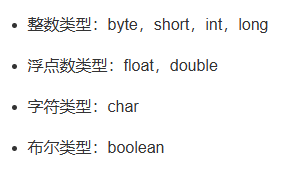
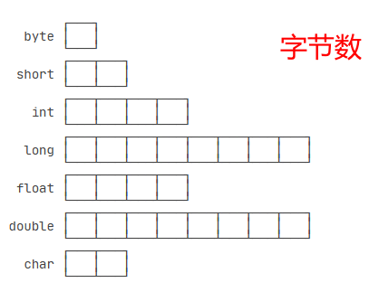
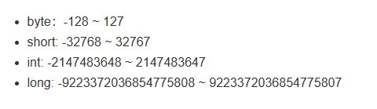

# 类型





注意浮点数（小数）是没有确定精度的，不是确定的值，无法确定的表达，所以会产生误差。例如下面两个值就不相等


```

double x = 1.0 / 10;
double y = 1 - 9.0 / 10;
// 观察x和y是否相等:
System.out.println(x);
System.out.println(y);
```

浮点数判断相等是通过两数相减的绝对值小于一个很小的值（如0.0000000001）来判断。

```
// 比较x和y是否相等，先计算其差的绝对值:
double r = Math.abs(x - y);
// 再判断绝对值是否足够小:
if (r < 0.00001) {
    // 可以认为相等
} else {
    // 不相等
}
```

# 注意！！！**自动类型提升**
