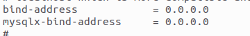
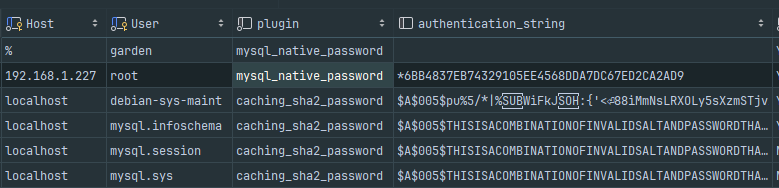
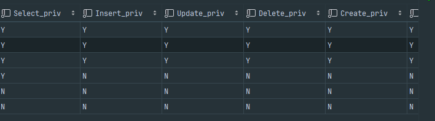

## 环境：ubuntu 22.04

使用方法：ubuntu apt直接安装

## 安装过程参考

在终端中执行以下命令，以确保您的系统软件包列表是最新的：

```bash
sudo apt update
```

升级系统以应用最新的安全更新和功能改进：

```bash
sudo apt upgrade
```

## 使用apt安装mysql

现在，我们将通过apt包管理器在Ubuntu 22.04上安装Nginx。apt是Ubuntu系统中用于管理软件包的强大工具，使得安装和更新软件变得非常简便。

执行以下命令以安装Nginx：

```bash
sudo apt install mysql-server
```

## 4. 验证安装

要验证MySQL服务器是否正在运行，你可以使用`systemctl`（对于使用systemd的系统）或`service`命令。

```bash
sudo systemctl status mysql
```

## 5.远程连接

修改mysql配置文件

> /etc/mysql/mysql.conf.d/mysqld.cnf 该目录下，修改这两个字段（mysql服务监听哪些主机地址的）
>
> 

配置连接本质就是配置mysql的user表的Host，User，plugin，authentication_string字段。

> Host
>
> 该用户允许哪些主机访问（注意nginx的反向代理，防火墙）%是默认的全部匹配和0.0.0.0一样

> User
>
> 用户名，没什么好说的

> plugin
>
> 该字段在目前这个环境需要设置为mysql_native_password才可以远程连接成功

> authentication_string
>
> 该字段就是以前的password，如果在创建新用户的时候，使用的password这个就是默认空，你就想爆炸都连不上

## 注意！！

> nginx 的反向代理具备默认服务配置，还有防火墙

> 现在的密码字段不是password了是authentication_string字段

> 如果创建新的用户注意权限问题，权限不赋予完全，是会出现连接失败的

## mysql user表参考，第二张图片的全部都是权限




