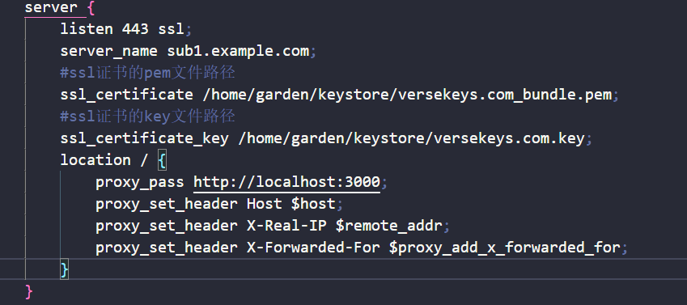

反向带理，在nginx.conf文件进行编辑

> 一个server就是一个服务的配置,如果你有两个项目需要在不同域名的情况下进入不同的项目，那么你就需要两个域名

> listen 监听的端口号，这里不说你项目监听的端口号，是监听到那个端口号的时候进行反向代理的意思

> server_name 监听该端口号上面的哪些域名，例如192.168.1.156，tenxun.com 这些主机，可以使用正则匹配

> location  / location是在满足上述监听的情况下要做什么， /是路由地址，

> proxy_pass 代理到那个地方
