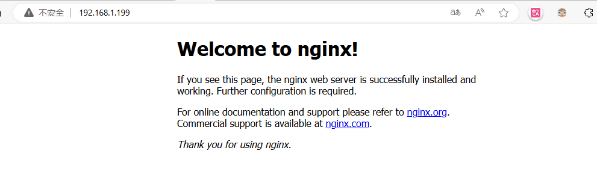

## 环境：ubuntu 22.04

使用方法：ubuntu apt直接安装

## 安装过程参考


在终端中执行以下命令，以确保您的系统软件包列表是最新的：

```bash
sudo apt update
```

升级系统以应用最新的安全更新和功能改进：

```bash
sudo apt upgrade
```

在安装Nginx之前，您可能需要安装一些依赖项，以确保Nginx能够正常运行。一般来说，这些依赖项已经在Ubuntu系统中安装，但为了确保完整性，您可以运行以下命令：

```bash
sudo apt install -y curl gnupg2 ca-certificates lsb-release
```

通过这些步骤，您的系统将会是最新的，并且具备了安装Nginx所需的基本条件。

### 使用apt安装Nginx

现在，我们将通过apt包管理器在Ubuntu 22.04上安装Nginx。apt是Ubuntu系统中用于管理软件包的强大工具，使得安装和更新软件变得非常简便。

执行以下命令以安装Nginx：

```bash
sudo apt install -y nginx
```

这会下载并安装Nginx及其相关组件。 `-y`选项表示在安装过程中不询问任何确认，直接进行安装。

安装完成后，可以使用以下命令启动Nginx服务：

```bash
sudo systemctl start nginx
```

确保Nginx在系统启动时自动启动，可以执行以下命令：

```bash
sudo systemctl enable nginx
```

现在，Nginx已成功安装并正在运行。

## 通过http:localhost进行验证出现下面界面就是成功了



## API参考

[如何在 Ubuntu 22.04 上安装、配置、使用 Nginx？-阿里云开发者社区 (aliyun.com)](https://developer.aliyun.com/article/1443902)
