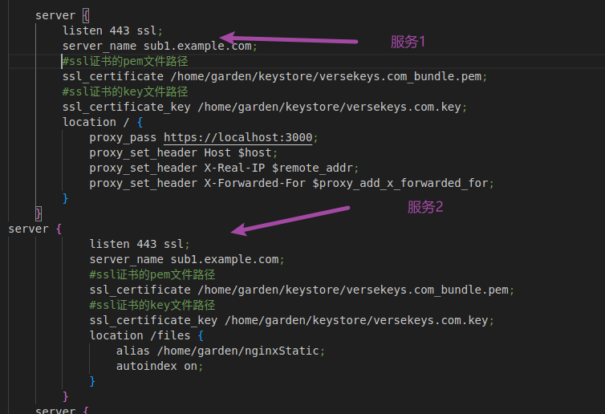
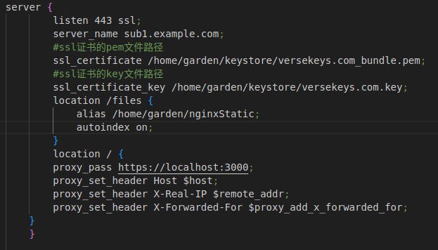
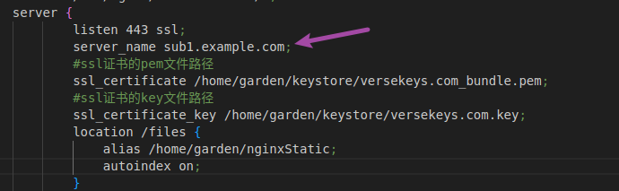

## 环境，ubuntu 22.04  nginx/1.18.0 (Ubuntu)

> 正常代码编写就是和编写一个反向代理服务是一样的

> ## 问题一 服务顺序
>
> ### 下面的服务1在服务2的前面，但是他们都是监听同一个主机同一个端口，并且服务1监听该路径下所有的路由，所有下方服务二会被拦截，无法生效。记住最小原则，要求最严格的放在前面。！！
>
> ### 但是如果你将服务2放在服务1前方一样无法实现既可以访问服务1又能访问服务2.通过观察发现，nginx的服务匹配同时匹配，端口号，主机地址。不会匹配路由，路由只是在匹配到该端口号主机之进行不同路由该干嘛这个描述（也和页面的路由配置一样），我们的服务1和服务2是一样的域名和端口号，所以谁在前面就匹配谁。
>
> ### 解决办法就是：将这两个服务配置为一个服务下面的不同路由，vue项目的路由中间会有#符号（哈希路由），所以也不会导致进入重复页面，见图二
>
> ### 记住#是哈希符号，https:\/\/sub1.example.com/#/pages/my/login和https:\/\/sub1.example.com/pages/my/login是不一样的，带#是被单页项目解析产生的。
>
> 
>
> 

> ## 问题二，主机地址问题

> ### 下方图片的主机就是正确的，在我的环境下，进行 *.example.com匹配全部子域名是不成立的，只能指定完整的域名。
>
> 

> ## 问题三 权限问题

> ### 当出现奇怪报错时，建议考虑一下权限问题。如果你/home/garden/nginxStatic这种路径，你的nginxStatic设置了全部用户都有权限，但是他的上级你没有配置，呢就是一样没有用。直接给nginx配置高权限用户参考：
>
> [nginx权限配置](https://www.cnblogs.com/smailpeanut/p/9400837.html)

> ## 描述
>
> 遇见问题尝试查看nginx的日志
>
> 实测在路由路径上后面不加\/可以正常运行
