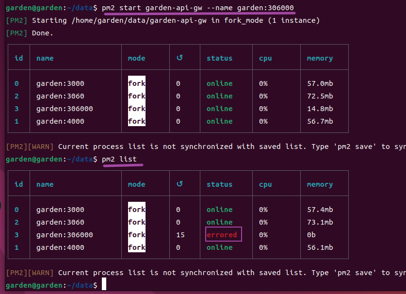

## 问题描述：

pm2运行之后进行pm2 list发现运行停止

> ### 原因描述：
>
> pm2 使用pm2 start garden-api-gw --name garden:306000命令时，找不到express项目的入口文件，猜测寻找是index关键字

> ### 解决办法：
>
> pm2 start \$(pwd)/garden-api-gw/bin/www --name garden:3060，对项目地址描述到www入口文件，$(pwd)是当前地址的意思。

> ### 还是无法解决，并且直接使用node运行还报告错误
>
> ### 这是因为有一些库不兼容导致的删除，重装大概率好
>
> rm -rf node\_modules 删除node\_modules文件夹
>
> rm package-lock.json 删除库的版本对应文件夹，防止下回原来版本
>
> npm install 重新安装
