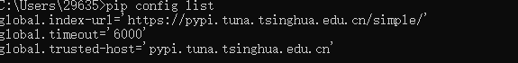

## pip config list

查看全局的pip已经配置的信息（如果自己没有配置，好像是没有的）

## pip config set global.index-url https://pypi.tuna.tsinghua.edu.cn/simple/

中间的global.index-url，global是全局的意思。index-url你要更改的全局属性

## 相关的api

[解决pip报错问题WARNING: There was an error checking the latest version of pip.\_更新pip还是报错warning: there was an error checking the -CSDN博客

[解决ERROR: Cannot determine archive format of C:\\Users\\Zz\\AppData\\Local\\Temp\\pip-req-build-t35bzb\_f-CSDN博客](https://blog.csdn.net/m0_50140251/article/details/115211970)
