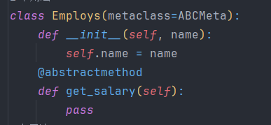
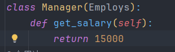
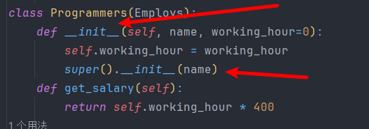

# 继承，封装，多态，工厂模式,抽象类和抽象方法

## api

[面向对象三大特性：封装、继承、多态（最全面最详细的解释）\_封装继承多态是面向对象编程的三大特征描述正确的是-CSDN博客](https://blog.csdn.net/frighting_ing/article/details/116708005)

## 抽象类

### 1.1什么是抽象类？

如果说，类是对一堆对象共同内容的抽取，那么抽象类就是对一堆类共同内容的抽取，包括：属性和方法。

### 1.2抽象类的特点

（1）抽象类必须包含一个或多个抽象方法，也可以包含普通方法。
（2）抽象类的抽象方法，在抽象类中并不作实现。
（3）抽象类不能被实例化。

（4）抽象类的子类要想进行实例化，必须先实现抽象父类中的所有抽象方法！！！！！！！！！！！！！

这是一个抽象类，它不能被实例化。

这是一个抽象类的子类，它实现（重写）了抽象方法，它可以被实例

> 注意：

### 怎么判断需不需要书写super().__init__()呢，并且里面需不需要添加函数呢，可以注意理解!!!

> - 当你没有进行 \_\_init__的重写（也就是你的子类没有书写__ \_\_init\_\_方法时），你的类使用的是继承的该方法，此时你不需要使用super（）来使用\_\_init\_\_方法声明属性
> - 当你进行了\_\_init__的重写（也就是你的子类书写了\_\_init\_\_方法时），而且你也需要父类的一些属性（就是父类的sefl.xxx=xxx）你就需要使用super()类初始化属性了，传递不传递参数就和函数的调用是一样的，
> - 本质就是super（）方法返回你一个父类的对象，而且可以通过它访问父类的不可见属性如\_\_init\_\_这种
