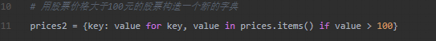
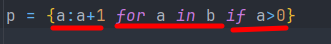
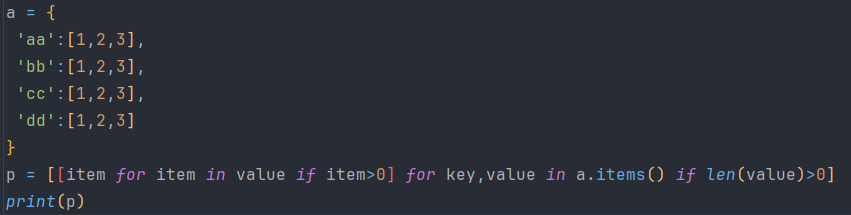
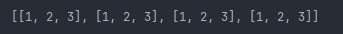

# 列表，元组，字典生成式和库

## 生成式

归纳最外层的符号是决定生成的是字典还是列表，{}（）,内部分为三部分，第一部分被填入的值，第二部分循环体，第三部分判断条件。执行顺序是先循环体在判断最后填入值

复杂生成式

生成结果

注意字典的迭代需要使用items（）方法将字典转换成数组对象

## 常用库

> `heapq`模块（堆排序）

> `items`itertools`模块

> `collections`模块

常用的工具类：

- `namedtuple`：命令元组，它是一个类工厂，接受类型的名称和属性列表来创建一个类。
- `deque`：双端队列，是列表的替代实现。Python中的列表底层是基于数组来实现的，而deque底层是双向链表，因此当你需要在头尾添加和删除元素时，deque会表现出更好的性能，渐近时间复杂度为$O(1)$。
- `Counter`：`dict`的子类，键是元素，值是元素的计数，它的`most_common()`方法可以帮助我们获取出现频率最高的元素。`Counter`和`dict`的继承关系我认为是值得商榷的，按照CARP原则，`Counter`跟`dict`的关系应该设计为关联关系更为合理。
- `OrderedDict`：`dict`的子类，它记录了键值对插入的顺序，看起来既有字典的行为，也有链表的行为。
- `defaultdict`：类似于字典类型，但是可以通过默认的工厂函数来获得键对应的默认值，相比字典中的`setdefault()`方法，这种做法更加高效。
