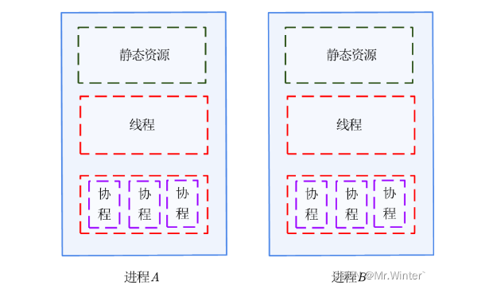

## API

[python多进程和多线程看这一篇就够了\_python 线程 高频循环-CSDN博客](https://blog.csdn.net/Victor2code/article/details/109005171)

## 归纳：

一个cpu核只能同时运行一个进程，一个进程可以有多个线程，进程的关闭开启需要消耗资源

同一个进程下的多个线程共享一个内存资源

进程资源不互通，使用Queue()进行资源通讯

python的每一个进程下面都具备一个GIL锁（和线程使用的lock锁是一样的，只是它是历史遗留的全局锁）

### 使用建议，对与使用cpu计算能力较多的任务进行多进程并发，对于使用计算能力不多，但是需要等待较多时间的任务——IO密集型任务（如爬取网页，文件读写）使用多线程并发

