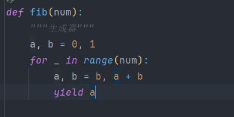

# 这是python的迭代规则

对一个对象进行迭代的时候，会先去查找这个对象具不具备迭代器规则（协议)`__iter__`和\_\_next\__

- 迭代器是实现了迭代器协议的对象。

  - Python中没有像`protocol`或`interface`这样的定义协议的关键字。
  - Python中用魔术方法表示协议。
  - `__iter__`和`__next__`魔术方法就是迭代器协议。

> \_\_iter\_\_方法一般都是返回这个对象的指向（self）然后也就会执行一次，虽然这个对象会被重复调用直到在\_\_next\_\_方法中执行到StopIteration（）方法

> yield关键字可以将一个函数变成一个生成器，使它变成具备迭代协议的对象，在每次迭代/函数运行的时候保留当前环境的状态，
>
> 
