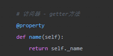
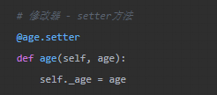
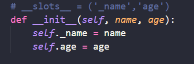
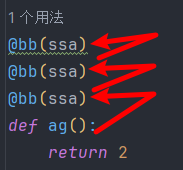
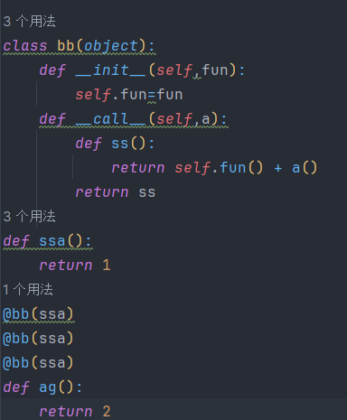
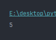

# 面向对象，类模块设计总结

## 重要理解！！！

### 类内部的 self可以理解为js的this。它在类的内部就等于是这个类，当类实例化的时候，这个self就是指向类的实例

### 类内部使用的cls和self的区别就是它不能被类的实例化对象继承，它永远指向这个类本身

### 这两个变量的名字是python程序员约定熟成的，是可变的。他们的确认是根据方法变量的位置决定的

### 易错点

带括号是类的实例化，不带是赋值类的引用


### API

导入
[Python 3.x | 史上最详解的 导入（import）「建议收藏」-腾讯云开发者社区-腾讯云 (tencent.com)](https://cloud.tencent.com/developer/article/2103543)
[Python 使用import导入模块的5种方式！ - Python技术站 (pythonjishu.com)](https://pythonjishu.com/python-import-5-way/)
下划线的区分
[再谈python的方法和属性私有化:单下划线，双下划线\_python私有方法一个横线-CSDN博客](https://blog.csdn.net/qq_26442553/article/details/82220476)
类属性和实例属性
[python3中类的重点与难点：类属性和实例属性的区别\_python 为什么调用实例属性调出来的是类属性-CSDN博客](https://blog.csdn.net/qq_41020281/article/details/79633603)
继承
[Python:类的继承，调用父类的属性和方法基础详解\_python继承父类的属性和方法-CSDN博客](https://blog.csdn.net/yilulvxing/article/details/85374142)
成员可见性
[Python的类和方法——成员可见性\_python 类成员可见性-CSDN博客](https://blog.csdn.net/sinat_38682860/article/details/89576297)

## 几个概念

### 类实例

### 继承

### 实例属性

### 类属性

### 私有和公开

## 成员可见性

私有的 ：希望外部不可以直接访问使用的属性方法需要在命名前面加"__"两个下划线

公开的：不做任何处理，默认就是公开的

设置成私有的之后子类无法使用这些方法

### 访问可见性补充说明

xx: 公有变量
\_x: 单前置下划线,私有化属性或方法，禁止通过from modules import *导入（约定熟成的，但不是不能访问）,但是类对象和子类可以访问
\_\_xx：双前置下划线,避免与子类中的属性命名冲突，无法在外部直接访问(名字重整所以访问不到)，类对象和子类不能访问
\_\_xx\_\_:双前后下划线,用户名字空间的魔法对象或属性。例如:\_\_init\_\_ , \_\_ 尽量不要自定义这种形式的。
xx\_:单后置下划线,用于避免与Python关键词的冲突

## 私有属性的替代方法

### @property包装器

使外界可以通过访问这个方法得到私有属性的值

### @ \<name\>.setter包装器\<name\>是属性名字

外界通过这个方法来触发私有属性的修改

### \_\_slots\_\_属性

解决问题：避免类被绑定新的不确定的属性

使用了\_\_slots\_\_之后self上声明的属性也必须满足在\_\_slots\_\_的元组里面

## 静态方法和类方法

### 静态方法 使用@staticmethod装饰器包装

静态方法解决的事情就像是在这个类运行前进行前置判断，因为它也是需要传递参数的，并不是使用类的内部参数，是独立在类内部的方法中的

### 类方法 使用@classmethod装饰器包装

类方法解决的事情就是它接受的是这个类本身 ，可以对类本身进行操作

## 装饰器

> 装饰器的本质可以理解为给一个人（定义的函数，不能是调用的函数）穿衣服，穿好了之后返回中这个人



装饰器有函数装饰器，类装饰器。

### 函数装饰器

语法糖——@wraps(cls)

```
def time_1():
    def aa(fun):
        def wrapper():
            start = time()
            sleep(1)
            t = fun()
            print(f'执行时间是{time() - start}')
            return t

        return wrapper
    return aa
@time_1
def sa():
    return True
#
@time_1()
def sa():
    return True
```

#### 第一个装饰器

- 使用方法：是不带括号的，是会在当前这个情况下报告错误的，
- 理解：不带括号就是定义引用的赋值所以它会将下面的函数直接传递为这个函数的参数，但是这个函数的本身不接受参数，所以报告错误了，尽管它的内部函数接受函数参数。
- 解决办法：加上括号，变成第二种使用方法，或者在装饰器这个函数添加参数

#### 第二个装饰器

- 使用方法：带括号的使用，可以在括号内传递参数给装饰器本身
- 理解：带括号都一般都是调用函数的调用参数都是接受至括号内的。所以下面传递上来的函数被括号内参数挤开了，只能在函数内部寻找接受参数的函数并且传入

#### 被装饰后的函数返回

- 理解：返回的值就是上面那个装饰器函数的返回值，注意需要返回的是函数！！不是函数的调用！！

  ```
  # 正确的，返回的函数
  def time_1():
      def aa(fun):
          def wrapper():
              start = time()
              sleep(1)
              t = fun()
              print(f'执行时间是{time() - start}')
              return t
          return wrapper
      return aa
  # 错误的，返回的函数调用结果
  def time_1():
      def aa(fun):
          def wrapper():
              start = time()
              sleep(1)
              t = fun()
              print(f'执行时间是{time() - start}')
              return t
          return wrapper()
      return aa()
  ```

  ### 类装饰器

> 区别：就是函数的传入地方不同

#### 不带括号的类装饰器

函数参数传递给 类的`__init__`方法，返回的是类的`__call__`方法本身

#### 带括号的类装饰器（）

括号内的参数传递给`__init__`方法，,函数参数传递给`__call__`方法，返回的是`__call__`的返回值

#### 接受的参数可以是函数！！！


返回值

