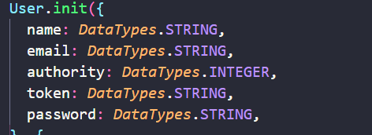
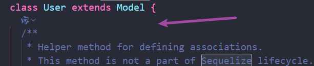

## 模型：位于models文件下的js文件,一个模型对应一张表

> ！！！ 模型下面自带一个index.js文件，当你发现使用var { User } = require('../models');导入老是出错时，不用怀疑，你就是把这个文件给弄了

> 每一个表的实例其实就是这个文件里面这个表类的实例，这个类拓展了sequelize。
>
> 既然是类就可以有类方法，类属性，
>
> 可以在Model大括号里面书写每一个表实例都可以使用的方法（这里可以使用下面init的类属性）

## 迁移文件：migrations文件夹下，可以理解为对表的操作文件，并且执行记录

> 每一个迁移文件都具备两个方法，up,down,这两个方法的作用就和他们的名字是一样的，一个上传执行，一个是回退执行,所有如果你没有编写回退执行代码，它就不会执行

> 当你需要对已经建立的表进行操作时，可以直接创建一个迁移文件，然后在文件内进行编写代码，最后运行

## 种子：seeders文件夹下，

## 配置文件：config文件夹下，

> 配置代码，没什么好说的
