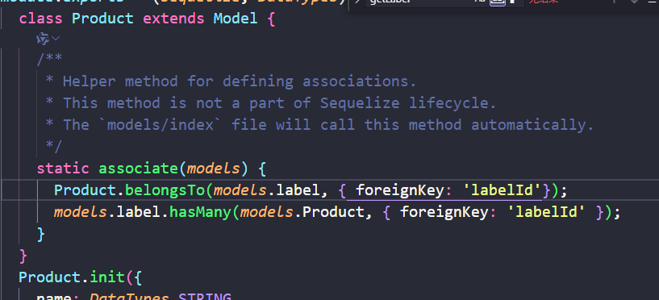
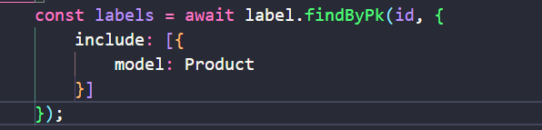

## 案例介绍：

商品表和类目表（多对一 关系）

在商品表已经创建完毕，并且外键在idea进行了外键的设立的时候进行的剩余操作

> 第一步,创建类目表——创建该表并无特殊，正常创建即可

> 第二步，对商品表的数据库模型文件进行修改
>
> 增加
>
> Product.belongsTo(models.label, { foreignKey: 'labelId'});
> models.label.hasMany(models.Product, { foreignKey: 'labelId' });
>
> 进行关联
>
> 

> 第三步，进行查询测试，
>
> 

## 注意事项

> 第二步，需注意模型名字，带s的一般都是数据库表的名字，说首字母大写的一般是模型名字，但是不是绝对的，有时自己生成文件可能会忘记这个规则，需注意

> 第三步，注意值的拿取，不清楚可以直接打印查询到的对象，
