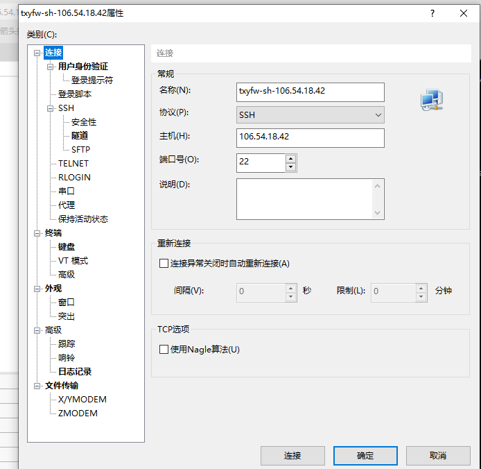

> 连接成功操作系统——ubuntu, centOs

## 准备

> Xshell 6 linux 连接工具

> FileZille 文件传输工具

## 开始

### 第一步，拿到服务器公网ip,端口号——这个一般服务器默认为你开启了22端口进行linux连接，用户名，密码

### 第二步，在Xshell 6新建一个连接（这里叫会话）协议使用默认的ssh就好了。也是点完连接之后才让你输入账号密码

### 第三步，进行FileZille 文件传输工具连接

> 注意：协议是Sftp,端口号不会给你显示默认的22出来，但是也是默认端口22（大概率的猜测）

## 服务器端配置ssh(服务器一般不用)
