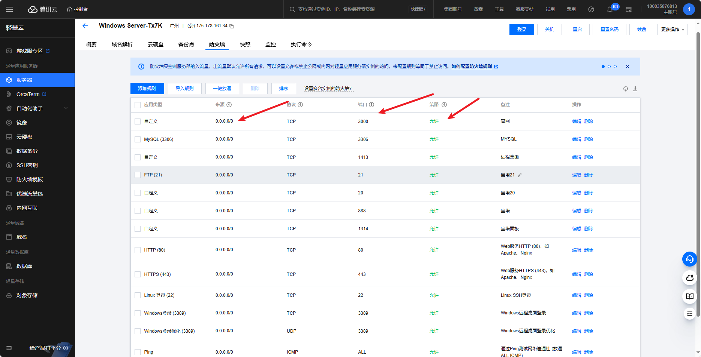
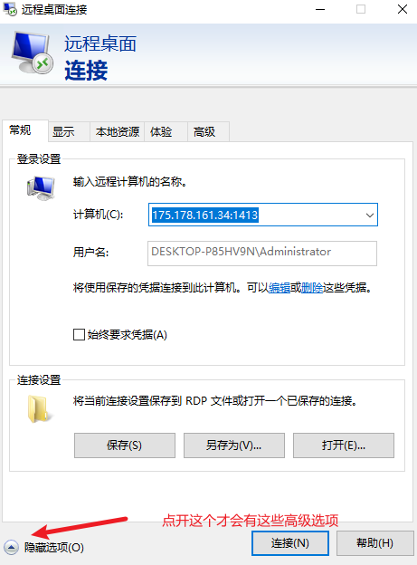

## 远程桌面连接

> [Windows 10远程桌面指定端口连接；端口号修改；远程桌面默认端口号\_mstsc 指定端口-CSDN博客](https://blog.csdn.net/WindNolose/article/details/122767185)

> 成功连接windows7

# !!! 注意防火墙的允许规则，端口号，ip没放开，端口号输错了，是一辈子的连接不上。。



> 0.0.0.0/0 的意思就是任何来源的IP和端口号
> 
> 后面的端口号就是，前面这些来源允许访问的端口号

> windows 默认远程桌面连接的端口号是3389，可以进行修改。但是没必要这么麻烦

## 第一步，拿到需要进行连接的Windows服务器的公网IP，桌面连接的端口号，电脑用户（默认是**Administrator**），电脑用户密码

## 第二步，打开远程桌面连接面板，



> 直接在计算机那里输入IP加端口号，下面用户名输入用户，密码等会会弹窗让你填，上面这个连接的用户就是Administrator，用户名前面附加的是在你IP在端口号时自动添加的。无需理会。

> 可以选择那个保存当前连接设置，下回就直接点就可以了

> 本地资源那里可以设置一些同步的资源，点开本地设备和资源的详细信息可以把本地磁盘进行网络共享，在服务器上面文件系统的网络找到。

# 本地windows连接

windows系统版本不一样可能会有支不支持现象，目前发现不支持的版本为家庭版

### 直接在电脑设置打开系统

### 然后点击远程桌面

### 然后点开启用远程桌面

### 点开高级设置


### 查看到远程桌面开放的端口号


## ssh终端连接

服务器需要配置 openSSH和防火墙（云服务默认配置好了）

1. **打开 PowerShell 作为管理员**：
   
   - 按 `Win + X` 键，选择“Windows PowerShell (管理员)”或“终端 (管理员)”。

2. **安装 OpenSSH 服务器**：
   
   - 运行以下命令来安装 OpenSSH 服务器：
     
     powershell
     
     ```
     Add-WindowsCapability -Online -Name OpenSSH.Server~~~~0.0.1.0
     ```

3. **启动并启用 SSH 服务**：
   
   - 安装完成后，启动 `sshd` 服务：
     
     powershell
     
     ```
     Start-Service sshd
     ```
   
   - 设置 `sshd` 服务开机自启：
     
     powershell
     
     ```
     Set-Service -Name sshd -StartupType 'Automatic'
     ```

4. **验证 SSH 服务状态**：
   
   - 检查 `sshd` 服务是否正在运行：
     
     powershell
     
     ```
     Get-Service sshd
     ```

### 配置防火墙

1. **打开防火墙规则**：
   
   - 确保防火墙允许 SSH 流量。运行以下命令来创建防火墙规则：
     
     powershell
     
     ```
     New-NetFirewallRule -Name sshd -DisplayName 'OpenSSH Server (sshd)' -Enabled True -Direction Inbound -Protocol TCP -Action Allow -LocalPort 22
     ```
